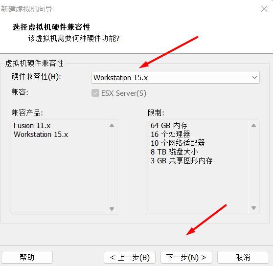
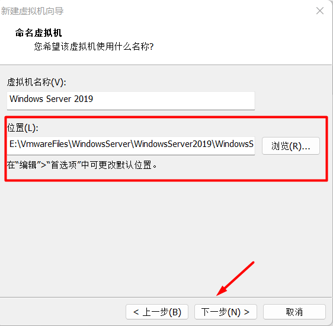

# 安装和配置Windows Server 2019

# 1. 安装Windows Server 2019

## 1.1 Windows Server 版本

Main releases include:

- Windows NT 3.1 Advanced Server (July 1993)
- Windows NT Server 3.5 (September 1994)
- Windows NT Server 3.51 (May 1995)
- Windows NT 4.0 Server (July 1996)
- Windows 2000 Server (December 1999)
- Windows Server 2003 (April 2003)
- Windows Server 2003 R2 (December 2005)
- Windows Server 2008 (February 2008)
- Windows Server 2008 R2 (October 2009)
- Windows Server 2012 (September 2012)
- Windows Server 2012 R2 (October 2013)
- Windows Server 2016 (October 2016)
- Windows Server 2019 (October 2018)
- Windows Server 2022 (August 2021)

## 1.2 Windows 版本

```
Early versions (Windows NT 3.1/3.5/3.51/4.0/2000)
Windows XP
Windows Vista
Windows 7
Windows 8 and 8.1
Windows 10
Windows 11
```

## 1.3 镜像下载

https://msdn.itellyou.cn/

**cn_windows_server_2019_updated_jan_2020_x64_dvd_4bbe2c37.iso**


https://www.microsoft.com/zh-CN/evalcenter/download-windows-10-enterprise

https://www.microsoft.com/zh-CN/evalcenter/download-windows-11-enterprise

## 1.4 虚拟机安装

在VMware中安装Windows Server 2019 虚拟机, 作为模板虚拟机.


硬件兼容性: 用15.x版本创建的虚拟机, 只能在15.x版本的VMware中打开.




对应版本没有提供时, 选择最接近的版本.





## 1.5 虚拟机硬件配置


删除不用的声卡和打印机硬件.


添加光盘.


**拍摄快照.**

- 空系统
- 还没有做系统安装


## 1.6 系统安装

看到这个提示, 直接按键盘任意键, 进入安装程序.


等待一段时间, 即可进入安装.


Datacenter版本比Standard版本的功能更多, 带桌面体验版本会提供图形化界面, 不带桌面体验的版本只有命令行界面.


选择自定义安装.


分配60G空间安装Windows Server, 剩余40G保留.


等待安装.


**Administrator**密码复杂度要求: 字母, 数字, 特殊符号. 没有长度要求.

这个**Administrator**是服务器内置的管理员账号, 用于本地管理.

服务器版本内置了**Administrator**作为内置的本地管理员.

这里设置 **Administrator** 密码为 **ZZyy522927.**


虚拟机或者RDP, 使用Ctrl+Alt+Insert解锁, 使用Ctrl+Alt+End锁屏.


本地用户名的前面没有域名, 域用户名的前面有域名`domain\username`.


## 1.7 安装VMware Tools工具

VMware Tools功能:

- 可以实现全屏窗口
- 可以实现在虚拟机和宿主机之间复制文件
- 宿主机和虚拟机的快捷键可以互相传递
- 虚拟机的时间和宿主机的时间自动同步

将鼠标指针放在虚拟机选项页, 右键单击, 选择"安装VMware Tools".


## 1.8 拍摄快照

快照名称: 系统安装完毕

DHCP获取ip

自动获取DNS

Administrator ZZyy522927.  

# 2. 配置Windows Server2019

## 2.1 配置静态ip


如果设置了静态ip和DNS后没有直接生效, 那么重启服务器, 确保网络可以连接.


## 2.2 修改计算机名称


先修改计算机描述.


再修改计算机名称.


修改计算机名称后, 必须重启服务器.


重启服务器.

## 2.3 激活系统

http://www.yishimei.cn/network/319.html


## 2.4 配置Windows更新


此时设置的是服务器一般情况下在哪个时间段使用, 系统不会在这个时间段内进行自动更新.


如果是生产环境, 一般不会采用自动更新, 都是手动更新.


等待更新完毕, 然后重启服务器.


## 2.5 IE增强安装设置

默认情况下,  通过IE访问网站, 会提示IE强安全配置正在使用. 这是因为IE增强安全默认开启, 会阻止通过IE访问任何网站.

需要手动点击关闭, 才能正常访问.


对于管理员账户, 关闭增强安全, 而普通用户保持开启.


关闭服务器管理器, 然后重新打开.


修改后, 通过管理员账号, 打开IE再次访问网站就不会提示增强安全配置信息.


把VMware Tools的驱动弹出.


## 2.6 拍摄快照

快照名称: 服务器初始化配置

静态ip 10.0.0.5

dns 8.8.8.8 1.1.1.2

计算机名称 WS2019

关闭自动更新

管理员取消IE增强安全设置

激活系统

弹出VMware Tools驱动

## 2.7 克隆三个Windows Server虚拟机

```
准备三个虚拟机

模板:   Administrator ZZyy522927.

Windows Server 2019 主机名 WS2019 10.0.0.5 00:0C:29:56:0F:E5

三个虚拟机: 修改MAC, 修改计算机描述, 计算机名, 修改IP地址

Windows Server 2019-51 主机名 WS2019-51 10.0.0.51 00:0C:29:56:0F:E6
Windows Server 2019-52 主机名 WS2019-52 10.0.0.52 00:0C:29:56:0F:E7
Windows Server 2019-53 主机名 WS2019-53 10.0.0.53 00:0C:29:56:0F:E8
```

## 2.8 创建Windows 10虚拟机

```
David ZZyy522927.

Windows-10 	10.0.0.230 	00:50:56:38:35:F3
W10-1		10.0.0.231 	00:50:56:38:35:F4
W10-2		10.0.0.232 	00:50:56:38:35:F5
W10-3		10.0.0.233 	00:50:56:38:35:F6
```

