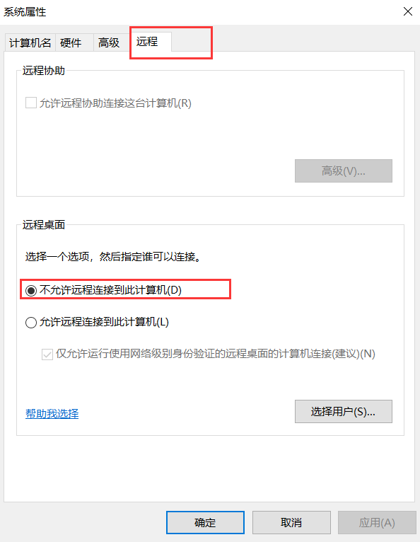
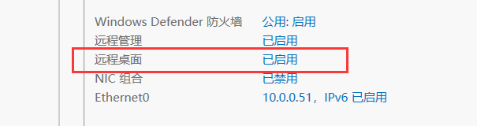
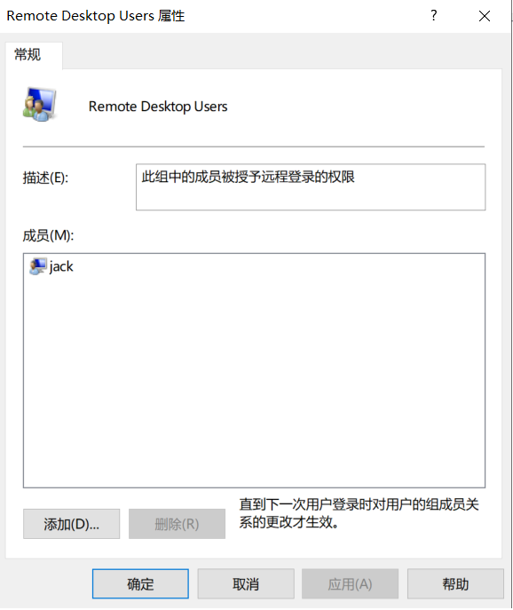
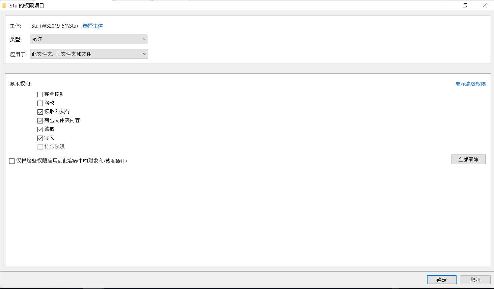
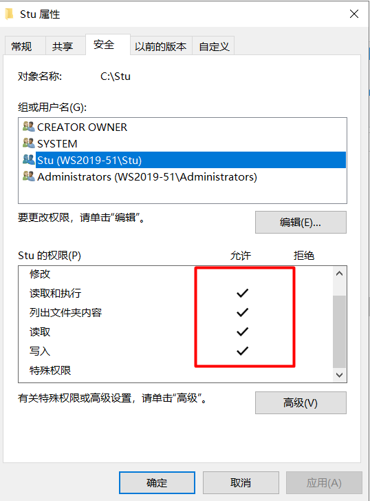
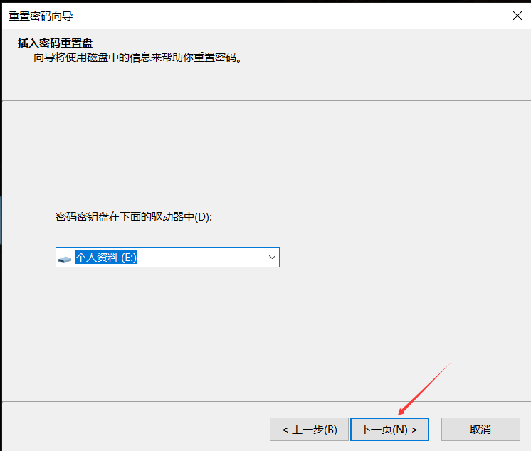
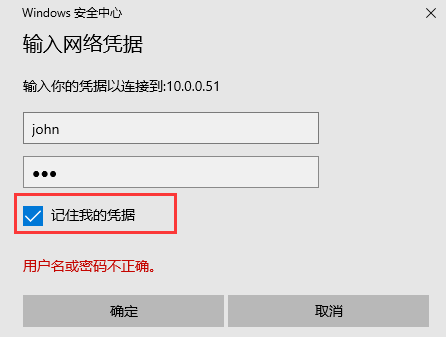
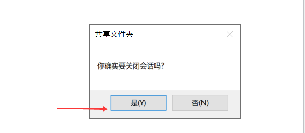
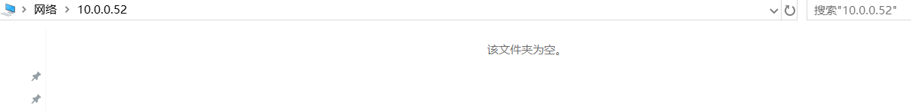

# 创建和管理用户和组

# 1. 创建账户和公共账户

## 1.1 创建本地用户

在**Windows Server 2019-51**上操作.


右键单击用户 - 选择新用户.


创建本地个人用户, david, 密码A1!

个人用户, 无论是域用户还是本地用户, 一般强制要求用户首次登录时修改密码.


创建一个本地公共账号, nurse, 密码A1!

公共账户会被多人使用, 所以建议选择密码不过期, 用户不可以更改密码.


## 1.2 修改默认的管理员Administrator的名字

Windows Server本地管理员账号默认都是使用Administrator. 因此, 需要手动修改账号名称, 防止有人使用默认的Administrator来猜密码. 之后再登录就要用修改后的名字登录.

修改前.


此外, 默认情况下, 本地Administrator的密码是永不过期的, 也需要修改该设置.


修改Administrator为Admin.


修改名称后, 注销. 重新登录需要使用**Admin**.


## 1.3 使用命令行创建用户

```cmd
C:\Users\Administrator>net user jack A1! /add # 创建用户, 并且设置密码
The command completed successfully.

PS C:\Users\Administrator> net user jack # 查看用户命令
User name                    jack
Full Name
Comment
User's comment
Country/region code          000 (System Default)
Account active               Yes
Account expires              Never

Password last set            9/03/2024 11:06:04 PM
Password expires             20/04/2024 11:06:04 PM
Password changeable          9/03/2024 11:06:04 PM
Password required            Yes
User may change password     Yes

Workstations allowed         All
Logon script
User profile
Home directory
Last logon                   Never

Logon hours allowed          All

Local Group Memberships      *Users
Global Group memberships     *None
The command completed successfully.

PS C:\Users\Administrator> net user jack A2! # 修改用户密码
The command completed successfully.
```

## 1.4 用户SID

每创建一个用户, 系统都会为该用户分配一个SID, Security Identification, 安全标识符. 计算机会通过该SID去识别用户, 应用权限, 而不是根据用户名去应用权限.

```powershell
PS C:\Users\Administrator> WMIC useraccount get name,sid # 查看用户SID
Name                SID
Admin               S-1-5-21-4070027767-1990543438-2010794172-500 # 本地管理员的SID为500.
# 同一台服务器上的不同用户的前面的数字相同, 后缀数字不同, 后缀数字表示用户身份.
david               S-1-5-21-4070027767-1990543438-2010794172-1000
DefaultAccount      S-1-5-21-4070027767-1990543438-2010794172-503
Guest               S-1-5-21-4070027767-1990543438-2010794172-501
jack                S-1-5-21-4070027767-1990543438-2010794172-1002
nurse               S-1-5-21-4070027767-1990543438-2010794172-1001
WDAGUtilityAccount  S-1-5-21-4070027767-1990543438-2010794172-504
```

案例: 验证系统会为每个创建的用户, 单独分配SID, 并且SID不会重复, 也不会被重复使用.

```powershell
#1. 创建一个用户, lily

PS C:\Users\Administrator> net user lily B2! /add
The command completed successfully.

PS C:\Users\Administrator> WMIC useraccount get name,sid
Name                SID
Admin               S-1-5-21-4070027767-1990543438-2010794172-500
david               S-1-5-21-4070027767-1990543438-2010794172-1000 # 普通用户的SID从1000开始
DefaultAccount      S-1-5-21-4070027767-1990543438-2010794172-503
Guest               S-1-5-21-4070027767-1990543438-2010794172-501
jack                S-1-5-21-4070027767-1990543438-2010794172-1002
lily                S-1-5-21-4070027767-1990543438-2010794172-1003 # lily的SID是1003
nurse               S-1-5-21-4070027767-1990543438-2010794172-1001
WDAGUtilityAccount  S-1-5-21-4070027767-1990543438-2010794172-504
```

```powershell
#2. 删除lily

PS C:\Users\Administrator> net user lily /delete
The command completed successfully.

PS C:\Users\Administrator> WMIC useraccount get name,sid
Name                SID
Admin               S-1-5-21-4070027767-1990543438-2010794172-500
david               S-1-5-21-4070027767-1990543438-2010794172-1000
DefaultAccount      S-1-5-21-4070027767-1990543438-2010794172-503
Guest               S-1-5-21-4070027767-1990543438-2010794172-501
jack                S-1-5-21-4070027767-1990543438-2010794172-1002
nurse               S-1-5-21-4070027767-1990543438-2010794172-1001
WDAGUtilityAccount  S-1-5-21-4070027767-1990543438-2010794172-504
```

```powershell
#3. 再次创建lily, 验证SID和此前的不同

PS C:\Users\Administrator> net user lily C1! /add
The command completed successfully.

PS C:\Users\Administrator> WMIC useraccount get name,sid
Name                SID
Admin               S-1-5-21-4070027767-1990543438-2010794172-500
david               S-1-5-21-4070027767-1990543438-2010794172-1000
DefaultAccount      S-1-5-21-4070027767-1990543438-2010794172-503
Guest               S-1-5-21-4070027767-1990543438-2010794172-501
jack                S-1-5-21-4070027767-1990543438-2010794172-1002
lily                S-1-5-21-4070027767-1990543438-2010794172-1004 # SID变成了1004, 可见, 每创建一个用户, 系统会自动分配一个新的SID. 即使此前的用户被删除了, SID也不会被重新分配.
nurse               S-1-5-21-4070027767-1990543438-2010794172-1001
WDAGUtilityAccount  S-1-5-21-4070027767-1990543438-2010794172-504
```

## 1.5 Windows显示文件扩展名

默认:


修改后:


## 1.6 查看文件所有者

右键单击文件名 - 属性 - 安全 - 高级


## 1.7 使用bat脚本批量创建用户

编辑脚本:


双击bat文件, 执行脚本, 查看结果:


# 2. 内置组和自定义组

## 2.1 内置组


Remote Desktop Users: 该组内的用户, 可以通过RDP工具远程连接到**该当前服务器**. 这个组内添加的用户**必须是该服务器本地存在的**.

Users: 本地新建用户, 默认都属于Users组.

内置组案例: 授权用户jack, 可以通过RDP远程登录到本服务器. 

1. 服务器开启远程桌面功能(默认禁用)

开启远程桌面功能后, 防火墙会自动打开远程桌面端口.







2. 在W10-1, 通过RDP工具, 使用jack用户连接到服务器. **这里的jack用户, 需要是已经在Windows Server上存在的用户, 而非Windows10本地用户.**


默认情况下, Remote Desktop Users这个组没有任何成员. 已经存在的本地用户, 如果想通过RDP远程访问该服务器, 那么需要被添加到该组中.


3. 这里把jack用户添加到Remote Desktop Users组.

这里就是把Windows Server这个服务器上的jack用户添加到本地的RDP用户组中.



4. 再次在W10-1上通过jack用户连接.


如果还是无法连接, 可以检查对端服务器的防火墙是否开启. 如果开启的话, 那么要放开RDP远程连接的端口.

3389是服务器RDP本地端口.


5. 从Remote Desktop Users组移除jack用户.


jack用户被从服务器上移除后, 已经建立的连接不会断开, 并且在当前连接中, 用户jack还是属于Remote Desktop Users组.

```cmd
whoami /all
```


不过, 被删除后, 如果再次通过jack用户发起新的RDP连接要求, 就会被拒绝.

换到W10-2, 以jack用户发起对10.0.0.51的RDP连接会失败, 因为jack的权限已经被删除.


当前W10-1上的连接注销后, 再次访问, 也会被拒绝远程访问.

案例: 服务器**本地管理员**用户, 可以管理当前登录到该服务器的用户连接, 比如注销用户连接.

在Windows Server 2019-51上查看当前连接.


右键单击, 选择断开用户连接, 那么jack用户的当前连接会被立即中断, 并返回提示信息给jack.


## 2.2 自定义组

在Windows Server 2019-51上, 将jack和john两个本地用户添加到Stu组.

```powershell
PS C:\Users\Administrator> net user john A1! /add
The command completed successfully.
```


## 2.3 通过组授权

1. 在服务器本地创建Stu目录, 仅允许Stu组中的用户访问.


先把Users的继承关系删除, 然后再删除Users组. 这是因为新建的普通用户默认都是属于Users组的, 默认也就都可以访问Stu目录.




确保Stu组是读取, 写入和执行权限.




这个Stu测试目录不能存放到Admin用户的私有目录, 否则其他用户是无法访问Admin用户的家目录的, 因为当前是登录的Admin用户.

**本地用户无论是在本地登录还是RDP登录时, 系统都会为用户构建令牌信息, 其中包含SID, 用户所属组信息, 以及特权信息. 因此, 修改了本地用户的权限后, 本地用户通常需要注销, 重新登录才会使新的权限生效**.

2. 分别用jack, john, lily三个用户登录该服务器, 测试目录访问的结果.

先把三个用户都加入到服务器的RDP组中, 这样就可以通过RDP远程访问.


- jack用户

此时, 是无法访问的, 因为jack用户当前的链接还是旧的, 需要注销后重新登录.


注销重新登录后, jack就可以访问Stu目录并且修改了.


- john


- lily没有权限访问Stu文件夹


## 2.4 给普通用户管理员权限

添加到本地的Administrators组即可.


## 2.5 组管理命令行

```cmd
# 将用户加到管理员组

C:\Users\Administrator>net localgroup Administrators lily /add
The command completed successfully.
```


# 3. 使用密码重设盘重设密码

重置用户密码的方法:

- 域环境

```
联系IT, 通过AD重置
ctrl+alt+end 重置密码
通过self service portal重置, 但一般要求事先配置了MFA
```

- 本地账号

```
1. 联系本地管理员, 登录到本地管理员账号, 然后重置密码. 但是不建议此方法, 因为管理员重置密码后, 会造成不可逆的用户账户信息丢失
2. ctrl+alt+end 重置密码, 前提是用户记得旧的密码
3. 密码重设盘  用户不记得旧密码
```

密码重设盘使用场景: 适用于Windows和Windows Server.

**忘了旧密码, 无法通过ctrl+alt+del锁屏, 然后更改密码.**

案例: 通过密码重设盘给本地用户重置密码.

1. 准备一个USB, 专门作为密码重设盘, 太小无需过大, 因为重设盘文件只有几KB.
2. 如果虚拟机无法获取到宿主机的USB, 那么需要在宿主机开启VMware USB Arbitration Service, 然后重启虚拟机, 并且确保虚拟机安装了USB连接器.

宿主机上按win+r, 输入services.msc进入服务设置, 启用VMware USB Arbitration Service.

3. 重启虚拟机, 验证USB控制器存在.


4. 在VMware工具栏中, 选择虚拟机, 然后选择可移动设备, 选择需要连接的USB, 然后选择连接.


5. 进入控制面板, 用户账户, 用户账户, 创建密码重设盘.


6. 选择一个专用的移动设备作为本机, 本地用户的密码重设盘.


7. 输入当前用户的密码, 这里我们当前登录的是Admin, 所以就是Admin的密码.


8. 完成后, 会在USB上生成一个userkey.psw文件.


9. 有了密码重设盘, 那么当用户忘记了旧的密码, 就可以直接在登录界面, 先输入一次错密码, 然后选择重置密码进行密码重置.





10. 用新的密码登录.


注意: 

```
密码重置盘用于本地用户忘记密码时, 进行重置密码
如果某台电脑只有一个用户, 那么该用户登录后, 可以自己做一个重置盘, 自己专用
如果是共享电脑, 那么所有的本地用户都可以登录到电脑, 然后在同一个USB上做自己的重置盘, 保留成不同的文件名即可
重置盘只认userkey.psw这个文件, 所以, 如果是共享电脑, 那么可以在每个人的文件前面, 添加人名, 区分是谁的文件
当某人需要重置时, 只需要其他人先登录, 然后修改psw文件名为userkey.psw即可, 这个文件的所有者是Everyone, 所以每个用户都可以修改该文件名
```


# 4. 管理网络凭证

网络凭证:

当使用某账户, 如(zhang, 123)登录计算机A时, 系统会自动为zhang这个用户创建一个令牌, 令牌(包括用户sid, 用户组的sid, 以及相应权限)包含了zhang用户的权限.

当通过zhang账户登录到A计算机后, 此时需要从计算机A登录到B计算机, 访问B计算机上的某个文件夹的某个文件, 那么就需要**提供B计算机上, 具有访问该目录该文件的账号和密码**, 如(li, 456), 访问时需要输入账号和密码. 需要先用这个账户登录B计算机, 然后再访问对应的目录.

当A计算机使用li, 456访问了一次B计算机后, 会把这个信息缓存下来, 之后就可以直接访问B计算机, 无需输入账号和密码. 因为, 在A计算机上会缓存凭证, 该凭证定义了访问B计算机时, 使用li, 456这个账户.

案例: 网络凭证

1. 使用jack用户登录Windows Server2019-51.


2. 在C盘下, 创建一个文件夹, **test**, 并且共享给**Everyone**, 赋予读写权限.


3. 在W10-1客户端, 访问服务器.


选择记住凭证, 这样凭证就会保存到本地, 即使Win10重启也不会丢失, 除非手动删除.

这里用Windows Server 2019-51计算机上的john用户访问.




4. 此时, 因为该test文件夹授予了Everyone读写权限, 所以, 在A计算机上, 通过任意账号访问都行, 只要使用的账号是在B计算机上存在的即可, 这样就都可以访问到B计算机, 并且访问到test文件夹. 这里用B计算机上的john用户访问.

注意: 共享的权限和远程RDP的权限不同, 远程RDP需要把本地的用户加入到RDP用户组, 而共享权限是需要确保使用的用户在被访问的主机的本地, 并且具有访问权限即可.


5. 访问后, 在test文件夹内创建一个test文件.


6. 这个test文件的所有者就是用于远程登录到这台计算机上的john用户.


7. 并且在Windows Server 2019-51上, 可以看到该Win10-1的连接.

普通用户无法管理其他用户的连接. 而当前服务器上登录的是jack用户.


8. 关闭此链接, 再重新访问, 就不需要再输入账号和密码了. 此时. 即使服务器重启, 也不会影响Win10通过凭证访问.

服务器上关闭会话.




W10-1重启. 


然后再次访问test共享目录.


9. 不过此时, 会出现安全隐患, 假如这是一次性访问, 之后需要禁止用户通过A计算机, 利用john用户访问B计算机的话, 还需要做额外操作.

方法1: 修改B计算机上john用户的密码, 并且重启服务器, 不推荐

方法2: 在A计算机上, 把访问凭证删除

查看当前保存的凭证: 这里保存的是**\\10.0.0.51\IPC$**

用户通过网络访问时, 会在此处保存凭证, 下次访问同一个服务器时, 会直接用这里的凭证, 如果需要修改, 可以进行编辑或者删除凭证, 然后重新访问, 再次保存一份.


删除后, A计算机就不再存储访问B计算机的凭证, 那么下次访问就还需要输入账号和密码.


10. 此方法也适用于, 用户确实需要在A计算机频繁的连接B计算机, 但是B计算机上的账号密码突然改了, 导致A计算机还因为保留着旧的凭证而无法访问, 此时就可以删除该凭证, 让用户在A计算机重新输入账号和密码.

**凭证保留时间:**

如果访问时, 没有选择记住我的凭证, 那么凭证会在计算机重启或者用户注销后, 失效.

如果访问时, 选择了记住我的凭证, 那么即使重启也不会失效, 因为会保存到磁盘, 只能手动删除.

# 5. 镜像账户

镜像账号: **当客户端和服务器上创建了相同的账号和密码**, 那么客户端访问**服务器的共享资源**, 会直接使用当前登录用户, 映射到服务器上的相同的用户, 并且拥有该用户在服务器上的所有权限.

如:

服务器A上有用户zhao, A1!, 并且属于管理员组.

客户端B上有用户zhao, A1!, 并且属于普通用户组.

此时, 可以直接在B计算机上, 登录zhao用户, 然后向A计算机上的共享资源发起访问, 无需输入用户名和密码, 并且连接到A计算机上后, 拥有的是服务器A上, zhao用户的相同的权限, 也就是管理员权限.

先删除W10-1上保存的Windows凭证.


案例:

1. 给Windows Server 2019-51上的nurse用户, 设置密码Aa112211, 同时在W10-1上创建nurse用户, 设置密码为Aa112211. **两个相同名称的用户密码必须一致**. 否则还是需要输入对端账号的用户名和密码才能访问.
2. 在W10-1上, 切换到nurse用户, 直接就可以访问Windows Server 2019-51, 无需输入用户名和密码.

Windows Server 2019-51服务器A.


客户端B:


确保本地没有凭证.


W10-1切换到nurse用户, 测试访问.


总结: 多个服务器可以有相同的账户名, 但是密码一定要设置成不同的, 否则一个服务器被攻破, 就可以直接扫描全网段的服务器ip, 并且利用镜像账号连接到其余服务器上的共享资源.

镜像账号使用案例: 

当需要从计算机A上, 定期将数据拷贝到计算机B, 并且自动完成, 无需手动输入账号和密码时, 可以使用镜像账号.


在A和B上, 创建相同的账号和密码, 并且在B上, 设置zhang账户可以操作对应的文件, 这样就可以配置定时任务完成数据的定时备份.

# 6. 使用缓存的凭证或镜像账户远程管理服务器

把对端主机的账户和密码缓存到本地, 之后每次访问时, 利用该缓存凭证去进行认证, 无需再次输入账号和密码.

准备两台服务器: 10.0.0.51, 10.0.0.52. 通过10.0.0.51去远程管理10.0.0.52上的服务.

Windows Server 2019-51        10.0.0.51        Admin  ZZyy522927.

Windows Server 2019-52    	10.0.0.52    	Administrator ZZyy522927.

如有需要, 关闭10.0.0.52上的防火墙.

在10.0.0.51上连接10.0.0.52.




确保可以凭借本地存储的凭证连接到10.0.0.52后, 就可以通过本主机上的**服务**, 连接到对端主机.


打开10.0.0.51上的服务管理.


连接成功后, 就可以在10.0.0.52上, 管理10.0.0.52的服务了.

同样, 也可以操作对端的**计算机管理**.


此时在会话中, 可以看到, 10.0.0.52上显示当前存在一个连接, 是从WS2019-51发起的, 并且登录到10.0.0.52上的账户是Administrator.


查看远程计算机上共享的文件夹.


也可以创建用户, 修改密码, 管理服务, **但是不能管理对端的磁盘.**

对端的注册表也可以进行管理.


注册表案例: 开启/关闭远程桌面功能(远程桌面功能: 通过RDP远程连接到服务器).

当前10.0.0.52的远程桌面功能是禁用的, 我们在10.0.0.51上远程连接过去后, 通过注册表把它开启.


0: 表示启用远程桌面

1: 表示禁用远程桌面


回到10.0.0.52, 重启服务器管理器, 验证远程桌面被启动.


# 7. 用户配置文件

在用户登录时, 服务器都会给用户初始化一个环境, 包含如桌面信息, 包含哪些图标, 快捷方式, 是否有某些固定的文件, 桌面背景图片等等.

每个用户在自己登录后, 都可以设置自定义的环境信息, 并且不同的环境不会冲突, 都是存储到C盘下, 每个用户的家目录下, 除了管理员, 其他用户是无法访问的.

因此, 当一台电脑是多人共用时, 私人文件可以放到自己的家目录, 而公共的文件, 要放到一个共享的目录(**C:\Users\Public**).

这个`Public`目录, 是该计算机上所有用户都可以访问的.

案例: 让登录到该系统的每个用户的桌面, 都有一个直接访问Chrome的快捷方式图标.

`Public`目录也包含了公用桌面功能, 但是默认是隐藏的, 并且如果需要在公用桌面目录内创建内容, 是需要管理员权限的.


将快捷方式放到公用桌面目录.


切换到其他用户测试.

当前用户:


切换到nurse:


**管理员可以打开所有人的私有目录.**

**Windows的凭证是按照用户区分的, 每个人有自己的凭证, 无法互相使用, 但是管理员可以管理所有人的凭证.**

案例: 管理**新建用户**的环境.

新建用户的环境都是从`Default`目录内的内容复制的, 这个`Default`目录是隐藏的. 如果需要新建用户默认拥有哪些文件, 图标等, 那么可以定义在Default目录内. 需要管理员权限.

需要注意的是, 这个Default目录, 和其子目录只有管理员有权限创建编辑删除文件和目录.

其他已经存在的用户, 登录后可以看到Default和子目录内的内容, 但是无法复制, 移动, 修改, 删除.

**并且, 在Default中新建的内容, 是不会被复制到已经登陆过的用户的家目录的, 因为只有新建用户在初次登录时会拷贝其中的内容, 对于已经登录过的用户, 要放到Public目录内.**

切换到Admin用户.


在Default/Downloads中, 放一个共享文件, 让新用户登录就可以看到.


在Windows Server 2019-51上创建一个新用户, 然后登陆测试.


可以看到公共桌面的快捷方式以及Downloads的默认文件.


而已经登录过的用户在Downloads中是看不到该DEFAULT文件的.


