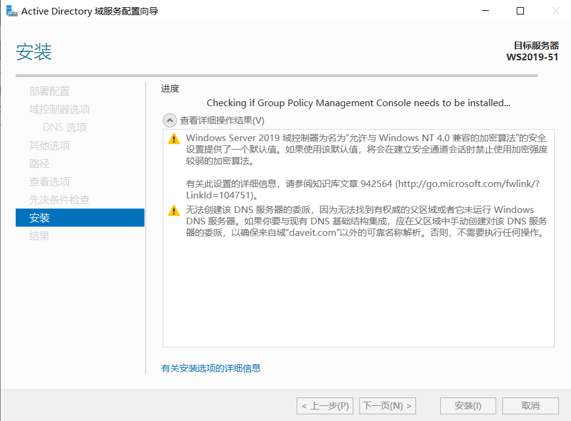
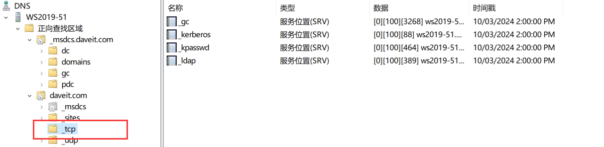
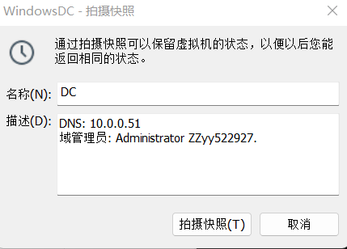
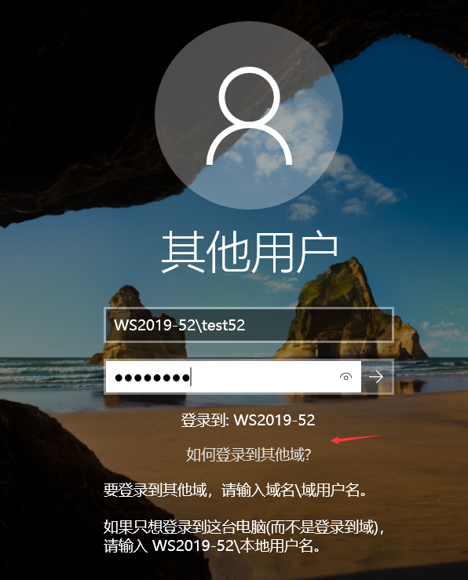
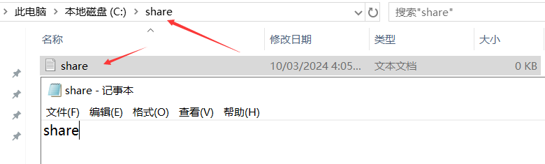
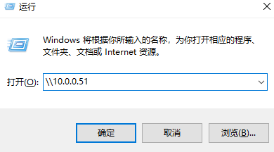
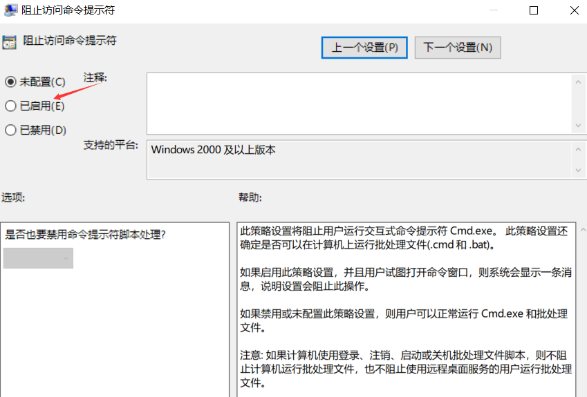
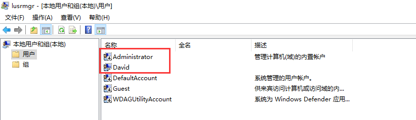

# 搭建域环境

# 1. 介绍活动目录域

工作组: 无法进行统一管理, 所有的管理和设置都只能在本地进行, 用户验证也是本地实现.

域: 搭建一个Windows Server作为**Domain Controller**, 并且在此服务器上安装**Active Directory Service**, 即可变成**域控制器**.

加入到域后, 计算机就和域控制器建立了信任关系, 那么在域控上创建的账号, 可以在域中, 任何一台计算机登录, 登录时, 会统一连接到域控制器上进行身份验证.

用户登录到一台计算机后, 访问其他域内计算机上的共享文件(共享给Domain Users组)时, 可以直接访问, 无需再次输入账号密码.

在域控上, 通过组策略, 可以对域中的计算机和用户进行管理控制.

**注意: 给计算机加入域时, 需要输入域管理员的账号和密码, 并且Windows家庭版是无法加入域的.**

使用域的好处:

​	统一身份验证

​	统一管理(使用组策略)

单域环境:

一个域内, 可以有多个DC, 每个DC之间互相信任, 同步信息.

计算机和用户只需要加入到一个DC, 其余DC会互相同步信息.

域内的计算机通过DNS服务找到DC, 每个DC会把自己的信息注册到DNS的SRV服务记录, 表明自己的身份和ip地址.

准备加入到域的计算机的DNS, 也要指向该DNS服务器, DNS会把DC信息返回给计算机.

域控和**即将/已经**加入到域的计算机之间, 只需要网络连通即可, 不需要在同一个网段内, 即使计算机和DC不在同一个地区, 也可以连通.

DNS服务器通常情况下, 也会有多个, 并且为了节省服务器, 一般会在DC上安装DNS服务, 这样计算机只需把DNS指向域控制器即可, **但是计算机实际还是通过DNS找到DC的**, 只不过此时DC和DNS都在同一个服务器上而已. 

# 2. 安装活动目录

实验环境:

一台DC: **Windows Server 2019-51, 10.0.0.51**, **安装了活动目录的Windows服务器就成了域控制器**. 在该服务器上, **安装活动目录和DNS服务**.

一台**Windows10, W10-1, 10.0.0.231**.

两台虚拟机分别还原快照到**初始化配置**.

修改Windows Server 2019-51的虚拟机名称为WindowsDC. 这个名字只是虚拟机的显示名称, 不会影响虚拟机的快照在磁盘存放的文件名称.


安装活动目录:

当DNS和域控部署在同一台服务器时, 作为域控的服务器, DNS只需要指向自己本地ip. 其他域内的计算机的DNS也指向这个ip地址.

修改WindowsDC的DNS为自己本地的ip, 之后在该服务器上部署了DNS服务后, 就可以为域内的服务器提供DNS服务器解析.

添加活动目录角色和功能.

升级成域控前, 先添加两个本地用户.

服务器本地管理员为Administrator.


修改前是WORKGROUP工作组.


选择添加角色和功能.


点击选择Active Directory域服务.


DNS无需手动选择, 会自行安装.


如果不小心把上面的窗口关闭了, 还可以通过右上角的警示符号进行设置.


- 将域控制器添加到现有域: 当已经有了一个域, 需要把该域控制器添加到该域, 作为一个附加域控.
- 将新域添加到现有林: 活动目录的最大单位是林. 林可以包含多个活动目录树, 而每个活动目录树可以包含多个域, 域与域之间是父域子域的继承关系. 每个树中, 只能有一个父域. 每个域中, 可以有多个域控. 多个域中的域控都是互相信任的, 任何用户都可以在整个林中的任何一个加入到域内的计算机登录.


- 添加新林: 添加一个新的林. 当环境中没有任何林和域时, 就选择添加林. **daveit.com**. 此时, 会创建一个林, 林内只有一个树, 树内只有一个根域. 域名必须是X.Y, 必须用`.`分隔开.


林功能级别和域功能级别: 规定了**附加域控**的**最低版本**, 如果功能级别是2016, 那么只有WindowsServer2016和WindowsServer2019可以作为附加域控制器加入到该林和域. 因为新版的功能, 旧版本不支持. 功能级别用来限制作为附加域控制器的服务器的版本, 对于加入到域内的计算机或者服务器, 如果不是作为附加域控, 那么是没有限制的.


活动目录还原密码: ZZyy522927. 进入活动目录恢复模式, 修复域控.


DNS服务会自动安装.


注意: 域控本身的计算机名称, 不要和域名相同. 如果域控的计算机名称为DC1, 那么域名就不能是DC1.com.

NetBIOS域名会自动识别, 保持默认即可.


数据库, 日志, SYSVOL存放位置: 为了提升性能, 可以把系统, 数据库, 日志, SYSVOL分别放到服务器的不同硬盘上.


如果现实先决条件检查失败, 那么需要按照提示先修改, 然后再继续安装.




安装成功后, 服务器会重启.

点击关闭.


升级成DC后, 该服务器上, 原有的本地用户会被删除, 只剩下Administrator用户.


内置的本地管理员用户Administrator会被自动提升为域管理员, 如果此前修改了本地管理员的名称, 那么提升为DC后, 也要用该修改后的管理员名称登录管理员账号, 并且要在AD中, 查看登录名, 并且修改显示名称.

# 3. 安装后的检查

1. 检查本地DNS配置: 指向本地ip地址.

安装DNS服务器, 会自动把DNS指向本地环回地址127.0.0.1, 需要修改为本地ip地址, 否则无法访问互联网. 并且不要添加备用DNS服务器. 修改了DNS后, 一般要等一段时间才会生效, 或者直接重启服务器. 


2. 在工具选项中, 打开DNS, 验证正向查找区域记录是否完整. 将计算机添加到域时, 必须通过SRV记录找到域控制器.


_gc: 查找全局目录

_kerberos: 身份验证

_kpasswd:

_ldap: 搜索域控制器

安装了DNS后, DNS会自动把该服务器注册到daveit.com这个域中, 添加一条主机A记录.


加入了域后, 计算机全名就变成了**计算机名.域名**.


3. 在工具选项中, 打开活动目录用户和计算机.

检查原有的本地内置管理员Administrator, 自动变成了域管理员.


升级为域控后, 是没有本地用户的. 原有的本地用户会被删除.


配置好DNS后, 域控就可以访问互联网, 并且为域内的其他计算机提供域名解析服务, 如果本地没有记录, 则会通过互联网上的DNS进行解析.


4. 如果安装了DNS后, 发现两个区域中的某些SRV记录缺失, 该怎么恢复?

这里先查看当前`_msdcs.daveit.com`和`daveit.com`两个区域的SRV记录.


删除该两个区域中的记录.


删除后.


恢复记录:

确保DNS指向本地ip地址.


确保两个域的动态更新都是安全更新, 表示只允许域内的计算机进行动态更新.


重启`netlogon`服务: 域中的计算机, netlogon服务开机自动启动, 工作组中的计算机是不启动的.

```cmd
C:\Users\Administrator>net stop netlogon
The Netlogon service is stopping.
The Netlogon service was stopped successfully.


C:\Users\Administrator>net start netlogon
The Netlogon service is starting..
The Netlogon service was started successfully.
```

也可以使用图形界面进行重启.


重新查看DNS记录, 如果没显示, 那么F5刷新DNS管理器界面, 重新查看.




5. 如果安装DNS后, 发现整个区域都缺失, 也就是没有正向查找区域, 那么可以手动自己创建.

安装DNS后, 默认的正向查找区域的命名是有规则的, 一个是`_msdcs.域名`, 另一个是`域名`.

先删除两个默认的正向查找区域.


新建域`_msdcs.daveit.com`.


新建区域`daveit.com`.


重启`netlogon`服务, 刷新后再次查看.

```cmd
C:\Users\Administrator>net stop netlogon
The Netlogon service is stopping.
The Netlogon service was stopped successfully.


C:\Users\Administrator>net start netlogon
The Netlogon service is starting..
The Netlogon service was started successfully.
```


如果重启`netlogon`后, SRV记录没有注册到两个区域中, 那么要检查DNS设置, 确保**在DNS中注册此连接的地址(R)**这一项是勾选上的.


**制作检查AD和DNS配置后的DC快照.**



# 4. 将计算机加入域

准备一台计算机W10-1, 10.0.0.231, 本地用户David, ZZyy522927.

准备一台服务器WS2019-52, 10.0.0.52, 本地管理员Administrator, ZZyy522927.

将WS2019-52加入到`daveit.com`.

1. 先修改DNS


2. 加入域


输入域管理员账号, 如果弹出该对话框, 说明已经找了域控.


此时, 点击确定后, 会报错, 因为该虚拟机是克隆得到的, 因为SID是冲突的. 要想加入到域, 那么SID是不能冲突的, 工作组则无所谓.


点击确定, 然后在该服务器上, 运行`sysprep.exe`.

`C:\Windows\System32\Sysprep`, 直接双击运行, 之后服务器会自动重启.


勾选通用.


重启后, 需要重新配置计算机.


登录后, 修改DNS.


修改计算机名称.


遇到该报错, 重启即可.


验证.


将W10-1加入到`daveit.com`.


注意: 普通的域用户, 也可以把计算机加入到域, 但是只能最多加10台, 而管理员是没有限制的.

将计算机加入到域后, 作为非DC时, 计算机可以用本地账号登录, 也可以用域账户登录.

登录时, 想要登录本地用户, 那么前缀要加计算机名, 想要登录到域用户, 需要加域名前缀, 域名\用户名.

想在本地和域之间切换, 需要选择如何登录到其他域?



本地账号登录后前面显示计算机名, 而用域用户登录后, 会显示域名前缀.


在DC上创建一个域用户, clark, ZZyy522927. 

然后在W10-1上作为域用户登录.


加入域的计算机可以再DC上看到.


同时, DNS也会把加入到域的计算机注册到DNS的A记录.


域中的计算机, 都可以通过域名进行解析, 前提是目标主机防火墙关闭.

```cmd
C:\Users\Administrator.DAVEIT>ping W10-1

Pinging W10-1.daveit.com [10.0.0.231] with 32 bytes of data:
Reply from 10.0.0.231: bytes=32 time<1ms TTL=128
Reply from 10.0.0.231: bytes=32 time<1ms TTL=128
Reply from 10.0.0.231: bytes=32 time<1ms TTL=128
Reply from 10.0.0.231: bytes=32 time<1ms TTL=128

Ping statistics for 10.0.0.231:
    Packets: Sent = 4, Received = 4, Lost = 0 (0% loss),
Approximate round trip times in milli-seconds:
    Minimum = 0ms, Maximum = 0ms, Average = 0ms

C:\Users\Administrator.DAVEIT>ping WS2019-51

Pinging WS2019-51.daveit.com [10.0.0.51] with 32 bytes of data:
Reply from 10.0.0.51: bytes=32 time<1ms TTL=128
Reply from 10.0.0.51: bytes=32 time<1ms TTL=128
Reply from 10.0.0.51: bytes=32 time<1ms TTL=128
Reply from 10.0.0.51: bytes=32 time<1ms TTL=128
```

域用户在不同的域内计算机登录时, 看到的磁盘信息都是本地计算机的, **除了用户自己的配置文件**.

注意: 加计算机加入域后, 无论是Windows还是服务器, 本地用户都是会被保留的. 用户可以登录本地用户, 也可以登录域用户.

# 5. 统一身份验证

域用户可以在域内的任何一台计算机登录, 当然不包括DC本身, 普通域用户是不能在DC上登录的.

在域控上创建的共享文件夹, 只要是共享给Everyone的, 就可以被域内的所有普通用户访问, 并且无需输入账号和密码信息.

1. 在DC上创建一个共享文件夹, 共享给Everyone.

注意: 普通用户是没有权限在DC上共享文件夹的.




2. 在W10-1上, 登录clark用户, 然后访问DC上的共享文件夹.



只要DC上的文件夹共享给了Everyone, 那么域中的账号就可以无需输入账号和密码就可以访问.


根据读取和写入权限, clark可以在share目录创建文件.


在DC上查看clark创建的文件.


# 6. 统一管理

给不同部门的用户, 创建不同的OU, 把用户添加到对应的OU, 然后对整个OU进行统一的权限设置.

案例1: 创建IT组织单位, 并创建用户sam属于IT这个OU. 创建Test这个OU, 并创建alan用户, 添加到Test这个OU. 对Test OU进行组策略设置, 让该OU内的用户, 无法在域内的计算机运行cmd和编辑注册表信息. 而IT OU的用户没有限制.

在DC上创建IT这个OU.


创建Test这个OU.


创建sam用户, 加入IT这个OU. sam, Aa112211


创建alan用户, 加入Test这个OU. alan, Aa112211


对Test这个OU设置组策略管理.





使用sam用户在W10-1登录, 验证sam可以运行cmd和regedit.


使用alan用户在WS2019-52上登录, 因为该主机仅仅是一个Windows服务器, 所以普通域用户默认是可以登录的. 而普通域用户是不可以在DC上登录的.

修改了组策略后, 当前登录的用户需要注销, 或者执行`gpupdate /force`刷新组策略才会生效.

如果是未登录的用户, 是不需要执行`gpupdate`的.


案例2: 通过组策略, 管理域内的所有计算机, 将域内所有非DC的计算机的本地管理员账号重命名为LocalAdmin.

Default Domain Policy是域内的默认策略, 可以针对域内的所有用户或者所有计算机生效.

修改前: W10-1. 本地存在一个默认的Administrator用户, 是本地内置管理员账号, 但是已经被禁用. 而David是安装系统时创建的管理员账号. David和Administrator都属于本地管理员Administrator组. Default Domain Policy策略改的是Windows的内置本地管理员.




默认.


改为LocalAdmin.


验证WS2019-52.

重启服务器, 或者更新gpupdate.


验证W10-1.

重启服务器, 或者更新gpupdate.

Windows的Administrator账户默认是禁用的, 所以只能查看到名字被修改, 但是无法登录.


