# 数据存储安全

# 1. 文件夹的NTFS权限

NTFS(New Technology File System)权限分为**文件夹权限**和**文件权限**. 

NTFS文件夹权限赋予了用户对于一个文件夹及其内部内容的访问权限.

文件夹默认继承上一级目录的权限, 并且可以取消继承.

只有NTFS格式的硬盘才能使用NTFS权限.

## 1.1 读取权限

**读取权限**可以授权用户**查看**该文件夹中的内容, 比如文件名和子文件夹名, 可以打开文件夹内的文件并且查看, 也可以打开子文件夹中的文件, 并且查看. **但是**, 不能在该文件夹及其子文件夹中创建文件和子目录, 也不能删除该文件夹中的内容. 

注意: 即使是域管理员, 也不具备对文件/文件夹的所有权限, 如果一个文件没有设置读取权限, 那么即使是域管理员也无法打开. 不过域管理员可以修改文件的权限, 来赋予自己权限.

**NTFS权限测试:**

1. 在Windows Server 2019-52上登录域管理员用户, 添加一个磁盘分区, 用于该案例.

在Windows Server 2019-52上登录域管理员账号. Administrator, ZZyy522927.

2. 在新建的卷上, 创建一个目录, test.

查看创建的目录的默认权限. 该目录的默认权限是从E盘继承来的. 

而文件夹的所有者是本地的管理员组**Administrators**.

属于**本地Users组**的用户对该目录有读取, 列出文件件内容和读取和执行权限, 以及特殊权限. 

特殊权限如下:

3. 禁止权限继承.

4. 删除特殊权限.

5. 创建域用户Nick, ZZyy522927., 先在Windows Server 2019-52上, 把Nick用户添加到本地RDP组. 然后在W10-1上通过RDP登录到Windows Server 2019-52上. 

在Windows Server 2019-52上开启远程桌面.

测试Nick通过RDP登录到Windows Server 2019-52上.

6. 在Windows Server 2019-52上, 登录域管理员账号, 在test目录创建一个文件, 再创建一个子目录, 并且在子文件夹再创建一个文件.

7. 在Windows Server 2019-52上, 登录域管理员账号, 修改test目录权限, 仅保留Users组的读取权限. 把User组的特殊权限删除.

8. Nick用户在W10-1上, 通过RDP登录到Windows Server 2019-52上, 访问test文件夹.

Nick作为普通域用户, 之所以能访问该目录, 是因为域用户属于Windows Server 2019-52本地的Users组, 而Users组对该目录有读取权限.

读取的具体高级权限.

## 1.2 列出文件夹内容权限

只能查看该文件夹和子文件夹中有哪些东西, 无法打开文件夹和子文件夹中的文件. 

1. Windows Server 2019-52上, 通过域管理员更改test目录的权限为**列出文件夹内容**.

修改为列出文件夹内容后, Nick用户就只能查看该目录/子目录里有哪些东西, 而无法打开具体文件了.

但是, Nick仍然可以进入子目录, 查看子目录的内容, 但是无法打开子目录内的文件.

## 1.3 读取和执行权限

允许用户打开并执行该目录以及子目录中的.exe程序. 一般不会给普通用户目录的执行权限. 避免有人恶意在目录内运行病毒程序.

1. Windows Server 2019-52上, 通过域管理员修改test目录权限为读取和执行, 修改为读取和执行时, 会把读取和列出文件夹内容的两个权限自动勾选.

## 1.4 写入权限

可以在目录中, 创建文件夹, 文件, 但是不能动别人的文件夹和文件. 而且创建的文件夹和文件是不能修改名称的. 

1. 在Windows Server 2019-52上修改test目录权限为写入权限.

**注意:** 写入权限要配置读取权限, 否则用户是无法打开文件夹的.

添加读取权限.

测试Nick用户在test目录中创建文件.

可以修改文件名.

可以删除.

读取和写入权限只能授权用户上传, 修改和删除自己创建的文件和文件夹. 不能动别人的.

1. 在test文件夹中, 通过Nick用户创建一个目录, Nick.

2. 创建另一个域账号, Vincent, 添加到10.0.0.52的RDP组.

3. 在10.0.0.231上, 通过RDP, 让Vincent用户访问10.0.0.52.

默认清空, 服务器不能接受过多的远程连接, 需要将当前连接的用户注销才行.

通过Vincent, 测试修改Nick创建的文件夹.

Vincent可以查看Nick创建的文件夹.

删除则需要权限.

重命名也需要权限.

**NTFS权限案例:** 让用户只能上传文件, 无法删除文件, 也无法修改文件. 

只给用户目录的写入权限, 不给读取权限.

服务器上创建work目录只有写入权限.

测试Vincent用户向work上传作业. 上传可以成功, 但是无法进入work文件夹. 

回到服务器查看.

测试Vincent修改文件.

可以看到, 只给写入权限, Vincent还是可以修改.

## 1.5 修改权限

除了修改目录本身的权限外, 可以做其他任何事.

添加修改权限后, 会把读取和执行, 列出文件夹内容, 读取以及写入权限都自动勾选.

可以在目录中创建文件.

可以删除和修改目录中自己创建的文件.

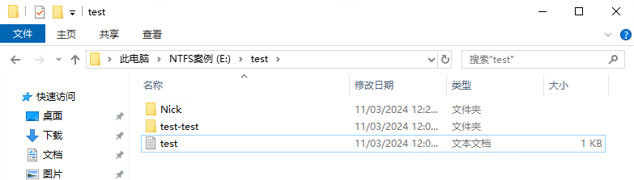

可以删除其他人创建的目录和文件, 修改文件和目录名称.

但是, 无法修改目录的权限.

## 1.6 完全控制

**完全控制:** 具有该目录的所有权限. 可以修改该目录的权限, 以及目录内的所有内容. 完全控制, 可以使用户具有修改文件夹权限的权利, 可以让别人也拥有权限.

不过, 完全控制, 并不能让用户修改文件所有者. 只有域管理员或本地管理员才能修改. 

# 2. 文件的NTFS权限

文件会默认继承所在目录的权限. 而文件或者文件夹默认继承的权限是无法修改的, 要么把继承删除, 要么把继承的权限转给自己, 之后才能修改.

禁用继承, 将已继承的权限, 转换为此对象的显示权限. 这个继承的权限, 就变成了自己本身的权限. 之后就可以修改这些权限了.

如果选择从此对象中删除所有已继承的权限, 那么该文件上的权限会被清空, 所有组或用户均不具有访问此对象的权限. 即使是文件的所有者, 也无法访问和修改文件. 但是该对象的所有者可以分配权限. 之后重新让用户可以访问.

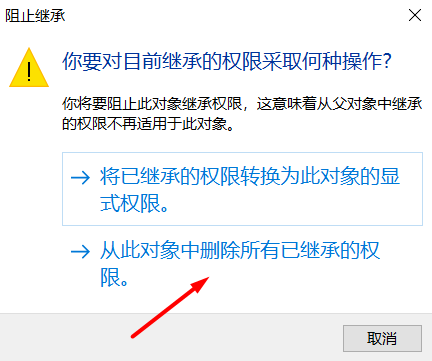

让域用户有完全控制权限.

切换到W10-1上的Nick用户验证.

此时, Nick用户可以修改该文件内容, 可以删除, 可以重命名.

文件权限优先级:

- 拒绝优先: Teacher组读写. A用于属于Teacher组, 拒绝A用户读. 此时, A用户是无法读的.
- 权限累加: Teacher组 读 Student组 写, A属于两个组. 此时, A即可读也可以写.
- 权限默认继承上一级的权限. 

# 3. 所有权和权限的继承

默认情况下, 文件夹和文件的创建者就是所有者. 所有者的权利最大. 

如果一个文件, 只有所有者有权限, 那么即使是域管理员用户也无法修改其内容, 也无法修改其权限. 此时, 域管理员需要把该文件的所有者, 修改为自己, 才能继续管理该文件. 这个操作适用于企业内有人创建了一个文件, 并且把其他人的权限都删除了, 而后此人离职了. 这时域管理员可以登录, 把所有者改为自己, 然后再添加权限. 

案例: 登录Windows Server 2019-52, 在E盘创建一个leave目录, 删除权限继承后, 给Users组添加写入和修改权限, 这样用户可以在这里创建文件.

Nick用户登录到W10-1, 再远程登录到服务器, 在leave目录里创建一个Nick-file文件, 并且把其他继承删除, 只留自己一个人的权限.

此时, 只有Nick对该文件有权限.

如果, Nick离职了, 那么其他人就无法访问, 也无法删除, 修改该文件. 这里可以在Windows Server 2019-52上, 通过域管理员测试.

此时, 如果Nick离职了, 那么只能由域管理员, 修改该文件的所有者,  然后重新分配权限, 再对其进行操作.

修改前.

修改后.

注意: 即使变成了所有者, 也无法打开文件. 必须添加权限.

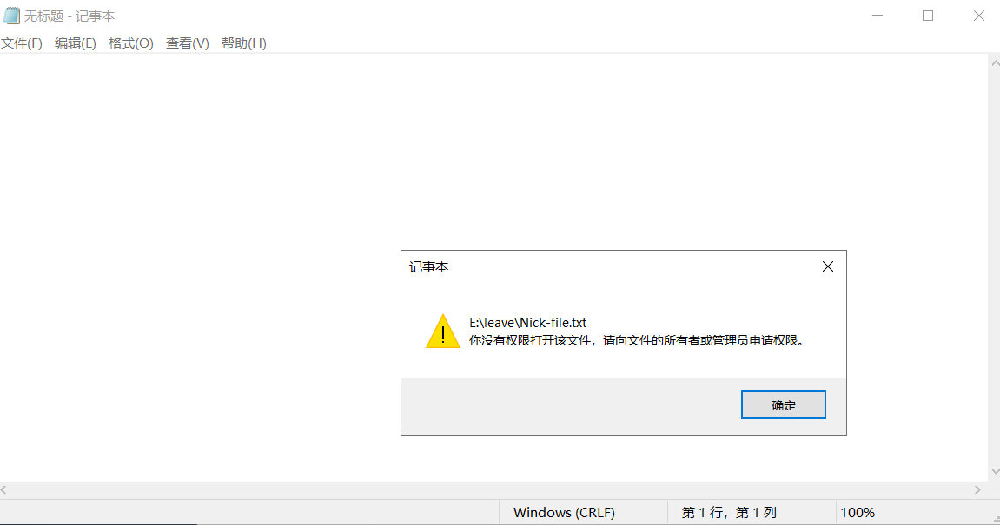

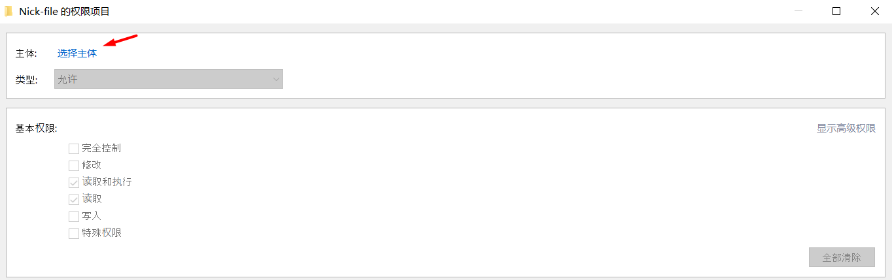

给域管理员添加了权限后, 就可以修改或删除该文件了.

域管理员也可以一次性把一个文件夹内的所有内容和子内容, 都改为自己为所有者.

案例: 分别用Nick和Vincent登录到10.0.0.52服务器. 在File目录中, 创建Nick目录和Vincent目录. Nick目录的所有者是Nick, Vincent的所有者是Vincent. 都改为Administrator.

File目录的所有者是服务器本地管理员组, Administrators.

Nick目录的所有者是Nick, Vincent目录的所有者是Vincent.

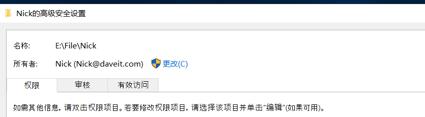

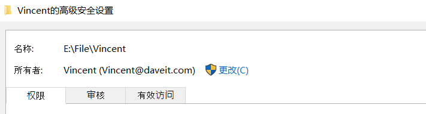

直接在每个目录, 把所有的子目录和文件所有者都改为域管理员.

把所有子目录和文件的所有者都改为自己, 域管理员就可以修改权限了.

案例: 刷新子目录和文件的继承权限, 让他们都有父目录相同的继承权限.

- 在子对象中, 可以阻止继承权限.

- 在父对象中, 可以强制子对象继承权限.

# 4. NTFS权限应用案例: 创建一个提交作业的文件夹

学生把作业提交到Homework文件夹.

学生只能对自己提交的文档有完全控制权.

对其他人提交的文件不能打开, 不能修改和删除.

不允许在Homework目录中创建文件夹.

1. 在10.0.0.52上, 创建homework目录.

2. 在域中创建学生组, 并添加用户.

3. 禁用homework目录的继承权限, 删除Users组的权限.

4. 授予Stu组权限.

5. 在W10-1分别登陆Stu-1和Stu-2账号, 向homework文件夹中提交文件.

Stu-1没有权限在homework中创建目录.

但是可以上传文件.

Stu-1对该文件有完全控制权.

Stu-2可以上传文件.

但是, 无法打开Stu-1的文件, 无法修改Stu-1的文件.

# 5. NTFS权限应用案例: 提交的作业不允许修改

此时, 学生提交作业后, 虽然无法在homework目录内, 直接对文件进行修改, 但是还是可以在桌面编辑文件后, 再拖进homework文件夹, 以此方式修改.

修改前.

在桌面修改文件, 然后拖拽到homework目录.

修改后.

如果想要禁止学生提交后, 再次进行修改, 那么要对homework目录的CREATE OWNER权限进行控制.

CREATE OWNER默认是完全控制, 要想禁止学生修改, 那么需要取消完全控制, 修改和写入权限.

测试Stu-2再次上传文件.

测试Stu-2再次修改文件.

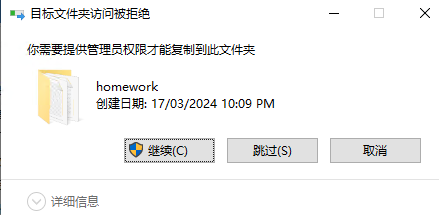

# 6. NTFS权限应用案例: 创建用户隔离的共享文件夹

案例: 创建一个存放个人数据的文件夹.

- 每个人只能在该文件夹中, 创建自己的文件夹, 但是不能直接创建文件.

- 在自己的文件夹中, 可以创建文件和子文件夹. 对自己的文件夹有完全控制权.

- 不允许访问其他人的文件夹. 更不允许删除和修改其他人的文件夹.

1. 创建sharefile目录, 禁止继承, 删除Users组权限.

2. 给Stu组添加权限.

3. CREATER OWNER主体.

CREATER OWNER主体表示, 谁在该sharefile目录中, 创建了文件夹, 那么该文件夹的所有者就是创建该文件夹的人.

如果Stu-1在sharefile中, 创建了Stu-1目录, 那么Stu-1对该目录的子目录和文件有完全控制权.

4. Stu-1在sharefile中创建Stu-1目录.

但是无法创建文件.

5. Stu-2在sharefile中创建Stu-2目录.

6. 但是, 两个用户无法访问对方的文件夹.

7. Stu-2在自己的目录内创建文件.

8. Stu-2可以修改和删除.

9. Stu-2无法向Stu-1的文件夹中上传文件.

# 7. EFS加密文件

NTFS格式的磁盘虽然可以对文件夹和文件设置权限, 但是一旦计算机丢失, 其他人就可以把硬盘取下来, 然后插在别的笔记本上即可直接使用.

EFS文件存储会对文件先进性加密, 然后存到硬盘上. 硬盘文件可以删除, 但是不能被解密.

## 7.1 加密技术

- 对称加密: 加密密钥和解密密钥是同一个密钥. 用字符串abc加密的一串数据, 需要用字符串abc去解密.
- 非对称加密: 密钥对. 通过公钥加密的文件, 需要其私钥解密. 反之亦然. 公钥和私钥密钥对需要成对使用.
- 非对称加密效率低, 对称加密效率高.

## 7.2 加密案例

1. Stu-1远程RDP到服务器, 创建一个目录, 然后创建一个文件.

2. 给该文件夹加密.

加密后, 系统会为执行加密的用户生成一个自签名证书. 

加密前没有证书.

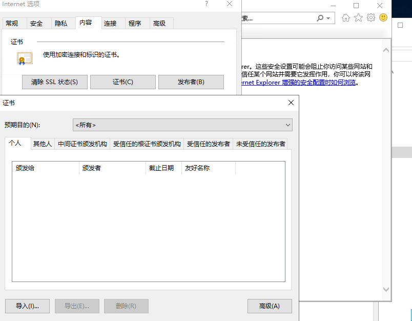

加密.

验证系统会生成证书.

3. 加密后, 虽然文件夹有NTFS权限, 但是用户想访问的话是必须有Stu-1的证书的. 否则就连域管理员都无法查看文件. 

4. 虽然无法查看文件, 但是还是可以将文件删除的. 而且, EFS生成的证书是个人证书, 必须用当前的用户登录系统才能看到该证书. 其他用户登录到该计算机上是无法查看到该证书的.

5. 加密后, 要备份证书.

文件加密后, 必须要有证书才能打开文件, 一旦证书丢失或者无法访问, 那么文件就无法查看了. 

所以可以把证书导出来, 然后存到一个安全的地方.

6. 让域管理员获取证书, 然后解密文件.

Stu-1用户在服务器上新建一个Key目录, 将证书文件复制到Key目录. 然后让域管理员从Key目录获取到证书, 然后导入.

7. 域管理员在服务器登录, 导入证书.

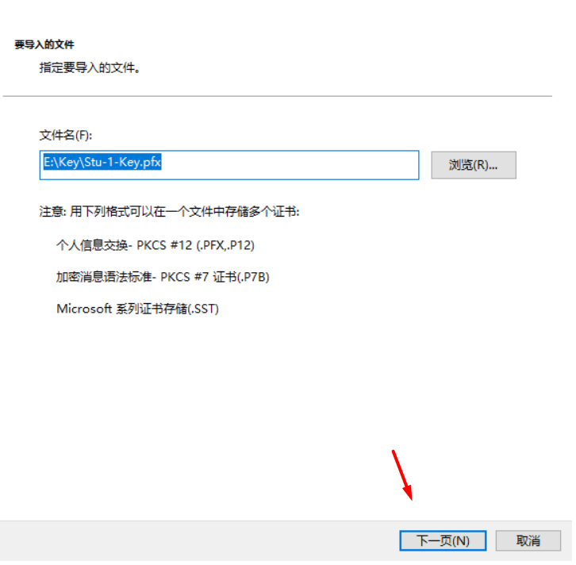

8. 测试域管理员打开并且编辑文件.

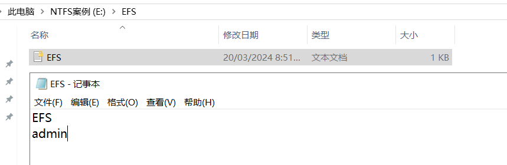

# 8. Bitlocker加密磁盘分区

EFS加密文件的缺点是需要有证书, 一旦证书丢失那么文件就无法打开了.

Bitlocker可以给单个文件或者整个磁盘加密, 加密使用密钥. 只要密钥没有丢失, 那么就可以查看文件. 即使硬盘被插在另一个电脑上, 只要输入密钥就可以继续访问文件.

案例: Bitlocker加密U盘.

1. 先将U盘连接到W10-1上.

2. 使用Bitlocker加密.

Windows系统一般都默认安装了Bitlocker程序.

选择输入密码解锁.

将密钥保存到文件.

加密整个磁盘.

加密后, 磁盘会显示一个密码锁.

3. 将U盘连接到服务器上, 进行解密.

服务器需要先安装Bitlocker程序.

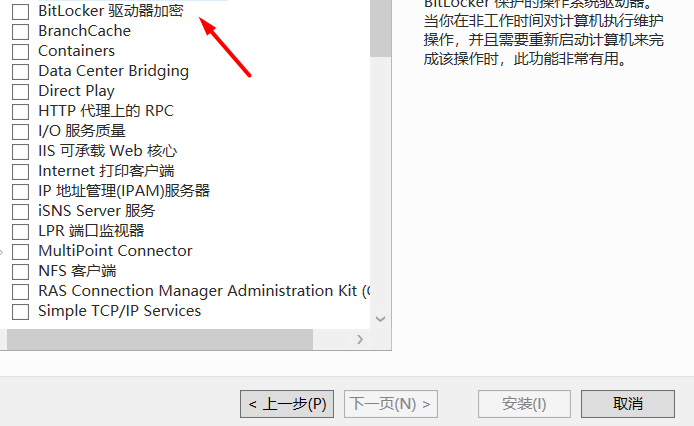

4. 安装成功后, 需要重启服务器.

5. 可以用解锁密码解锁.

并且硬盘放到新的计算机上, 解锁后, 会同时进行加密.

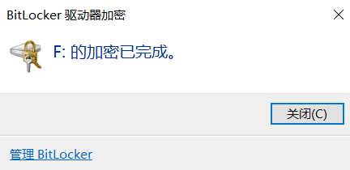

6. 也可以用密钥解密.

在服务器上重新给U盘加密.

7. 解锁时, 选择恢复密钥, 那么就可以通过密钥解锁. 但是, 解锁时, 要对比Bitlocker提示的前8位是否和解锁文件中的标识符是否一致, 否则是无法解锁的.

# 9. 磁盘限额控制用户使用分区的空间大小

格式化服务器E盘. 然后右键属性, 进入配额.

默认情况下, 如果开启了配额限制, 那么本地和域管理员是没有限制的.

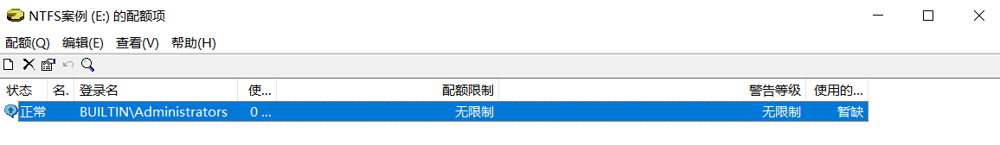

注销后, 登录管理员账号, 可以看到磁盘空间仍是39.9G.

再次注销, 登录Stu-1账号. 这时, E盘就只显示1G.

如果Stu-1往里存放大于1G的文件, 就会提示需要管理员权限.

输入管理员账号后就可以复制了.

添加配额项. 针对Stu-2进行限制. 允许10G存放空间.

切换到Stu-2登录.

# 10. 卷影副本

卷影副本是NTFS文件系统的特性. 

可以将一个磁盘分区内的文件, 定时, 备份到另一个磁盘分区. 比如, 设置每天晚上10点, 自动将D盘内的文件, 备份到E盘, 可以备份是增量备份, 是备份那些发生变化的. 而且每次备份都是重新生成一个时间戳. 一旦出现问题, 可以根据时间点进行恢复.
