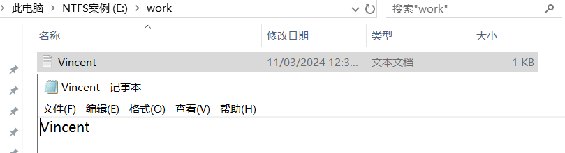

# 数据存储安全

# 1. 文件夹的NTFS权限

NTFS(New Technology File System)权限分为**文件夹权限**和**文件权限**. 

NTFS文件夹权限赋予了用户对于一个文件夹及其内部内容的访问权限.

文件夹默认继承上一级目录的权限, 并且可以取消继承.

只有NTFS格式的硬盘才能使用NTFS权限.

## 1.1 读取权限

**读取权限**可以授权用户**查看**该文件夹中的内容, 比如文件名和子文件夹名, 可以打开文件夹内的文件并且查看, 也可以打开子文件夹中的文件, 并且查看. **但是**, 不能在该文件夹及其子文件夹中创建文件和子目录, 也不能删除该文件夹中的内容. 

注意: 即使是域管理员, 也不具备对文件/文件夹的所有权限, 如果一个文件没有设置读取权限, 那么即使是域管理员也无法打开. 不过域管理员可以修改文件的权限, 来赋予自己权限.

**NTFS权限测试:**

1. 在Windows Server 2019-52上登录域管理员用户, 添加一个磁盘分区, 用于该案例.

在Windows Server 2019-52上登录域管理员账号. Administrator, ZZyy522927.

2. 在新建的卷上, 创建一个目录, test.

查看创建的目录的默认权限. 该目录的默认权限是从E盘继承来的. 

而文件夹的所有者是本地的管理员**Administrators**.

属于**本地Users组**的用户对该目录有读取, 列出文件件内容和读取和执行权限, 以及特殊权限. 

特殊权限如下:

3. 禁止权限继承

4. 删除特殊权限

5. 创建域用户Nick, ZZyy522927., 在W10-1上通过RDP登录到Windows Server 2019-52上. 先在Windows Server 2019-52上, 把Nick用户添加到本地RDP组.

在Windows Server 2019-52上开启远程桌面.

测试Nick通过RDP登录到Windows Server 2019-52上.

6. 在Windows Server 2019-52上, 登录域管理员账号, 在test目录创建一个文件, 再创建一个子目录, 并且在子文件夹再创建一个文件.

7. 在Windows Server 2019-52上, 登录域管理员账号, 修改test目录权限, 仅保留Users组的读取权限. 把User组的特殊权限删除.

8. Nick用户在W10-1上, 通过RDP登录到Windows Server 2019-52上, 访问test文件夹.

Nick作为普通域用户, 之所以能访问该目录, 是因为域用户属于Windows Server 2019-52本地的Users组, 而Users组对该目录有读取权限.

读取的具体高级权限.

## 1.2 列出文件夹内容权限

只能查看该文件夹和子文件夹中有哪些东西, 无法打开文件夹和子文件夹中的文件. 

1. Windows Server 2019-52上, 通过域管理员更改test目录的权限为**列出文件夹内容**.

修改为列出文件夹内容后, Nick用户就只能查看该目录里有哪些东西, 而无法打开具体文件了.

但是, Ncik仍然可以进入子目录, 查看子目录的内容, 但是无法打开子目录内的文件.

## 1.3 读取和执行权限

允许用户打开并执行该目录以及子目录中的.exe程序. 一般不会给普通用户目录的执行权限. 避免有人恶意在目录内运行病毒程序.

1. Windows Server 2019-52上, 通过域管理员修改test目录权限为读取和执行, 修改为读取和执行时, 会把读取和列出文件夹内容的两个权限自动勾选.

## 1.4 写入权限

可以在目录中, 创建文件夹, 文件, 但是不能动别人的文件夹和文件. 而且创建的文件夹和文件是不能修改名称的. 

1. 在Windows Server 2019-52上修改test目录权限为写入权限.

**注意:** 写入权限要配置读取权限, 否则用户是无法打开文件夹的.

添加读取权限.

测试Nick用户在test目录中创建文件.

可以修改文件名.

可以删除.

读取和写入权限只能授权用户上传, 修改和删除自己创建的文件和文件夹. 不能动别人的.

1. 在test文件夹中, 通过Nick用户创建一个目录, Nick

2. 创建另一个域账号, Vincent, 添加到10.0.0.52的RDP组.

3. 在10.0.0.231上, 通过RDP, 让Vincent用户访问10.0.0.52.

默认清空, 服务器不能接受过多的远程连接, 需要将当前连接的用户注销才行.

通过Vincent, 测试修改Nick创建的文件夹.

Vincent可以查看Nick创建的文件夹.

删除则需要权限.

重命名也需要权限.

NTFS权限案例: 让用户只能上传文件, 无法删除文件, 也无法修改文件. 

只给用户目录的写入权限, 不给读取权限.

服务器上创建work目录只有写入权限.

测试Vincent用户向work上传作业. 上传可以成功, 但是无法进入work文件夹. 

回到服务器查看.

测试Vincent修改文件.

可以看到, 只给写入权限, Vincent还是可以修改.

测试把写入权限细化到只有该文件夹.

服务器端验证上传成功.

Vincent尝试修改.

还是可以修改.

## 1.5 修改权限

除了修改目录本身的权限外, 可以做其他任何事.

添加修改权限后, 会把读取和执行, 列出文件夹内容, 读取以及写入权限都自动勾选.

可以在目录中创建文件.

可以删除和修改目录中自己创建的文件.

可以删除其他人创建的目录和文件, 修改文件和目录名称.

但是, 无法修改目录的权限.

## 1.6 完全控制

**完全控制:** 具有该目录的所有权限. 可以修改该目录的权限, 以及目录内的所有内容. 完全控制, 可以使用户具有修改文件夹权限的权利, 可以让别人也拥有权限.

不过, 完全控制, 并不能让用户修改文件所有者. 只有域管理员或本地管理员才能修改. 

