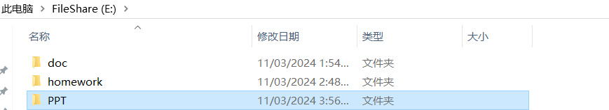
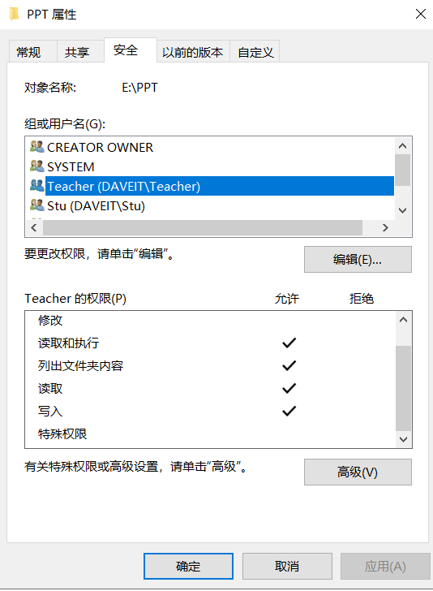
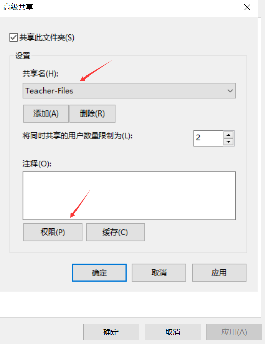
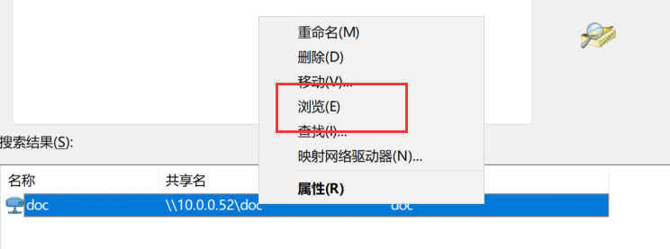
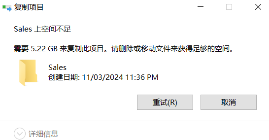

# 搭建文件服务器

# 1. 介绍NTFS权限和共享权限

文件服务器硬件要求: 

- 硬盘容量大
- 转速高

本文将`Windows Server 2019-52`作为文件服务器. 该文件服务器要求加入到`daveit.com`域中.

1. 利用域管理员账号, 登录到文件服务器.


2. 在`E`盘创建`doc`目录, 作为共享目录.


3. 在域控上, 创建一个`Teacher`组, 并且创建两个账号(`Wang`, `Zhang`), 加入到`Teacher`组.


4. 设置`doc`文件夹的共享权限, 赋予`Teacher`组读取和写入权限.


5. 在`W10-1`上, 登录`Wang`账号, 测试`doc`目录的读取和写入.


6. 查看`doc`目录的NTFS权限. `Teacher`组有完全控制权限.


7. 将`doc`赋予`Teacher`组的共享权限改为仅读取.


8. 再次测试`Wang`账号在`doc`目录的读取和写入.

仍然可以读取.


但是无法再次写入.


也无法在此前`Wang`自己创建的目录中写入.

这里之所以`Wang`无法再次写入, 是因为共享权限里的写入权限被取消了, 而账号如果想在共享文件夹内进行操作, 那么共享权限和NTFS权限同时需要满足.

9. 把共享权限中`Teacher`的写入权限重新添加, 测试`Wang`又可以再次在`doc`目录写入数据.


10. 使用共享向导: 共享向导针对某个文件夹开启后, 会把共享的权限同时应用在NTFS权限上. 如果共享权限是读取, 那么NTFS权限也会被设为读取. 如果共享权限是读取和写入, 那么NTFS权限会被设为完全控制. 


11. 如果想要实现更细致精确的权限控制, 那么要取消文件夹的使用共享向导功能.

新建`homework`文件夹, 取消使用共享向导功能.


此时, 需要先进行高级共享.


设置了高级共享后, 并不会在NTFS权限中, 给予`Teacher`组相应的权限, 而是需要单独配置NTFS权限.


总结: 

1. 只要通过`UNC`路径的访问, 就会受到共享权限和NTFS权限的控制. `UNC`就是: `\\10.0.0.52`. 无论是通过远程访问, 还是在文件服务器本地访问, 只要是通过`UNC`路径访问的都会受到共享权限和NTFS权限的控制.
2. 如果是打开的本地路径(`E:\doc`), 那么本地路径只受NTFS权限的控制.

3. 用户实际具有的权限是共享权限和NTFS权限的交集.

# 2. 多次共享和隐藏共享

## 2.1 多次共享

被共享的文件夹, 在文件服务器本地的名, 可以和被共享出去的名称不同. 比如, 在文件服务器本地, 文件夹的名称是`PPT`, 而发布到网络上的名称可以是`Files`或者是其他的名字. 并且, 一个文件服务器本地的共享目录, 可以对应多个网络上不同名字的共享目录.

1. 在文件服务器创建`PPT`共享文件夹.



2. 在`DC`创建`Stu`组, 创建用户`Li`, `Meng`, 然后加入到`Stu`组.


3. 先把`PPT`目录共享给`Stu`组, 只允许学生查看.

`\\10.0.0.52\Stu-Files`


4. 再共享为`Teacher-Files`, 允许老师读写.


5. 给`PPT`目录添加NTFS权限.

`Stu`组只能读.


`Teacher`组可以读写.



6. 测试学生组和老师组的访问.

Li属于学生组.


`Stu`组只能在`Stu-Files`中查看.


`Teacher`组可以在`Teacher-Files`中查看和写入.


切换到`Stu`账号, 发现学生也能写入. 这是因为, 共享路径有`Everyone`的权限. 需要把`Everyone`的权限删除.





再次测试学生组和老师组的权限.

学生可以查看`Stu-Files`, 但是不能写入.


学生不可以查看`Teacher-Files`目录, 因为在`Teacher-Files`的共享权限设置了只有`Teacher`组有权限读写.


切换到老师账号.

老师也无法访问学生的目录.


老师可以在自己的目录读写.


但是不可以删除别人的文件. 虽然在共享中添加了更改权限, 但是因为没有NTFS更改权限, 所以老师还是不能修改其他人的目录.


注意: 只有域管理员能管理文件服务器的共享,  普通用户没有权限. 而且, 共享只是针对目录, 文件是没办法共享的.

在文件服务器的计算机管理中, 可以查看到当前服务器共享出去的目录都有哪些, 以及其他具体信息.


## 2.2 默认共享


这些默认共享都是为了域管理员准备的, 只有域管理员账号能访问这些共享.

每个硬盘分区都有一个默认共享.

通过域管理员访问`c$`.


`E$`.


`ADMIN$`.


## 2.3 隐藏共享

共享目录后带有`$`后缀的文件夹就是隐藏共享. 此时, 必须知道目录名才能被访问.

1. 在服务器创建`pic$`目录, 设为隐藏共享, 仅给管理员完全控制权限.


2. 修改NTFS权限.


3. 在`Windows Server 2019-52`上, 通过域管理员账号访问, 看不到`pic`目录, 因为已经被隐藏了.


4. 需要添加`pic$`, 才能访问.


5. 而其他用户访问到`10.0.0.52`是看不到`pic`目录的, 也无法访问`pic$`.


# 3. 管理默认共享

默认共享存在安全隐患, 一旦管理员的密码泄露, 那么就可以远程连接到的服务器的系统目录把文件拷贝走.

所以, 可以把默认共享给删了.

```cmd
C:\Users\Administrator.DAVEIT>net share

Share name   Resource                        Remark

-------------------------------------------------------------------------------
C$           C:\                             默认共享
IPC$                                         远程 IPC
E$           E:\                             默认共享
pic$         E:\pic
ADMIN$       C:\Windows                      远程管理
doc          E:\doc
homework     E:\homework
The command completed successfully.
```

```cmd
C:\Users\Administrator.DAVEIT>net share /?
The syntax of this command is:

NET SHARE
sharename
          sharename=drive:path [/GRANT:user,[READ | CHANGE | FULL]]
                               [/USERS:number | /UNLIMITED]
                               [/REMARK:"text"]
                               [/CACHE:Manual | Documents| Programs | BranchCache | None]
          sharename [/USERS:number | /UNLIMITED]
                    [/REMARK:"text"]
                    [/CACHE:Manual | Documents | Programs | BranchCache | None]
          {sharename | devicename | drive:path} /DELETE
          sharename \\computername /DELETE
```

```cmd
# 删除c$, ADMIN$, E$

C:\Users\Administrator.DAVEIT>net share c$ /delete
c$ was deleted successfully.


C:\Users\Administrator.DAVEIT>net share E$ /delete
E$ was deleted successfully.


C:\Users\Administrator.DAVEIT>net share ADMIN$ /delete
ADMIN$ was deleted successfully.


C:\Users\Administrator.DAVEIT>net share

Share name   Resource                        Remark

-------------------------------------------------------------------------------
pic$         E:\pic
IPC$                                         远程 IPC
doc          E:\doc
homework     E:\homework
The command completed successfully.
```

并且, 可以让服务器每次开机, 都执行默认共享目录的删除操作.

1. 把删除的命令写入到`.bat`脚本中.


2. 添加到开机自动运行脚本.


开机脚本存放路径: `C:\Windows\System32\GroupPolicy\Machine\Scripts\Startup`


3. 之后, 服务器每次开机, 这些默认共享目录就会被删除.

这里恢复`Windows Server 2019-52`到加域快照, 测试脚本.

```cmd
# 添加脚本前有如下默认共享.

C:\Users\Administrator.DAVEIT>net share

Share name   Resource                        Remark

-------------------------------------------------------------------------------
C$           C:\                             默认共享
IPC$                                         远程 IPC
ADMIN$       C:\Windows                      远程管理
The command completed successfully.
```

添加脚本.


重启服务器验证.

```cmd
C:\Users\Administrator.DAVEIT>net share

Share name   Resource                        Remark

-------------------------------------------------------------------------------
IPC$                                         远程 IPC
The command completed successfully.
```

也可以通过注册表去管理默认共享.

1. 将服务器恢复到加域快照.

```cmd
C:\Users\Administrator.DAVEIT>net share

Share name   Resource                        Remark

-------------------------------------------------------------------------------
C$           C:\                             默认共享
IPC$                                         远程 IPC
ADMIN$       C:\Windows                      远程管理
The command completed successfully.
```

2. 修改注册表.

路径: `计算机\HKEY_LOCAL_MACHINE\SYSTEM\CurrentControlSet\Services\LanmanServer\Parameters`  

```cmd
创建AutoShareWks, Dword值为:00000000
创建AutoShareServer, Dword值为:00000000
```


3. 重启服务器.


# 4. 使用net share命令管理共享

- 查看共享 `net share`

- 创建共享 `net share sharedata=e:\data`

注意: 一个文件服务器上, 不能有重复的共享名.


```cmd
# 在服务器创建一个目录, 名为doc, 共享名为docfile

C:\Users\Administrator.DAVEIT>net share

Share name   Resource                        Remark

-------------------------------------------------------------------------------
C$           C:\                             默认共享
IPC$                                         远程 IPC
E$           E:\                             默认共享
ADMIN$       C:\Windows                      远程管理
docfile      e:\doc
The command completed successfully.
```


- 删除共享 `net share sharedata /delete`

```cmd
C:\Users\Administrator.DAVEIT>net share docfile /delete
docfile was deleted successfully.


C:\Users\Administrator.DAVEIT>net share

Share name   Resource                        Remark

-------------------------------------------------------------------------------
C$           C:\                             默认共享
E$           E:\                             默认共享
IPC$                                         远程 IPC
ADMIN$       C:\Windows                      远程管理
The command completed successfully.
```

- `run - gpedit.msc` 打组策略编辑器

# 5. 脱机使用文件

脱机使用文件: 计算机在离线的清空下, 如果访问和修改文件服务器上的共享文件.

1. 将`doc`目录共享给`Everyone`, 并且具有读写权限.


2. 开启共享缓存.


3. 在`doc`目录中, 创建两个文件.


4. 在`W10-1`上访问共享, 选择**始终脱机可用**.


5. 断开`W10-1`的网络, 再次测试访问`file1`.


6. 同步更新.

此时, 服务器上的文件是旧版的.


7. 在客户端连网后, 选择同步.


8. 回到服务器查看.


9. 假如, 脱机时, 服务器上也有人修改了文章, 那么再次连网同步时, 会出现冲突.

断开计算机网络.


计算机上编辑`file1`.


服务器上编辑`file1`.


10. 计算机上连网, 同步`file1`.


# 6. 访问共享文件夹排错

1. 查看访问共享文件夹使用的端口.

`netstat -n`

无论使用`ip`地址访问, 还是计算机名称访问, 访问的都是文件服务器的`TCP 445`端口.


2. 服务器防火墙配置.

`wf.msc`


如果把`445`端口禁用, 那么就从外部访问文件服务器了.

3. 服务器网卡选项: **Microsoft 网络的文件和打印机共享**.

这个功能关闭了就相当于把服务器上的`445`端口关闭了.


4. 客户端上网卡选项: **Microsoft 网络客户端**.

这个功能关闭了, 那么客户端就无法访问外部的共享了.


5. 如果文件服务器有两个网卡, 一个连接外网, 一个连接内网. 那么要把连接外网的网卡的 **Microsoft 网络的文件和打印机共享**选项给取消, 这样就可以禁止外部的人访问文件服务器.

6. 服务器上的`WorkStation`服务, 一旦停止, 那么别人就无法访问服务器上的共享服务.


7. 服务器上`Server`的服务是否启动.


# 7. 将共享文件夹发布到活动目录

案例: 将文件服务器上的`doc`目录, 发布到`AD`中. 方便其他人在活动目录中查找企业只共享的资源.

1. 设置共享权限和NTFS权限.


2. 在`AD`中创建共享目录.


3. 之后可以在`AD`中, 直接搜索该共享目录, 并且直接浏览.





4. 其余域内用户, 如果在本地安装了`AD`, 也可以这样搜索, 然后把该共享目录, 映射到网络共享.

# 8. 安装文件服务器限制文件夹大小和存放文件的类型

案例: 限制文件夹大小.

1. 安装**文件服务器资源管理器**和**重复数据删除功能**.


2. 通过配额, 控制文件夹的大小. 这个配额是基于文件的. 而此前第四章的磁盘限额是基于用户的.

当磁盘的大小固定时, 通过配额来限制不同目录能存放的数据的大小.


硬配额: 不允许超过最大值.

软配额: 可以超过最大值, 但是会发出警告.


3. 测速`Sales`目录不能超过`100M`.

复制一个镜像到`Sales`目录.




案例: 限制存放的文件类型.

1. 创建文件屏蔽.


2. 不让存放音频和视频文件.


3. 允许在`Sales`的子目录中放音频和视频文件.


4. 测试在`audio`中存放音频文件.


# 9. 为域用户设置主目录

为用户设置自己的家目录.

1. 选中`Wang`, 右键属性.


2. 在主文件夹中, 连接到远程的文件服务器.


3. `W10-1`上`Wang`用户注销后重新登录.


4. 给`Li`用户也添加主目录.


5. `W10-1`上登录`Li`账户.


# 10. 文件服务器统计重复的文件

1. 在`E`盘中的不同位置存放`1.txt`文件.

2. 存储报告管理.


# 11. 在域环境中配置分布式文件系统DFS


# 12. 利用DFS实现容错和负载均衡


# 13. 利用DFS分发和收集文件