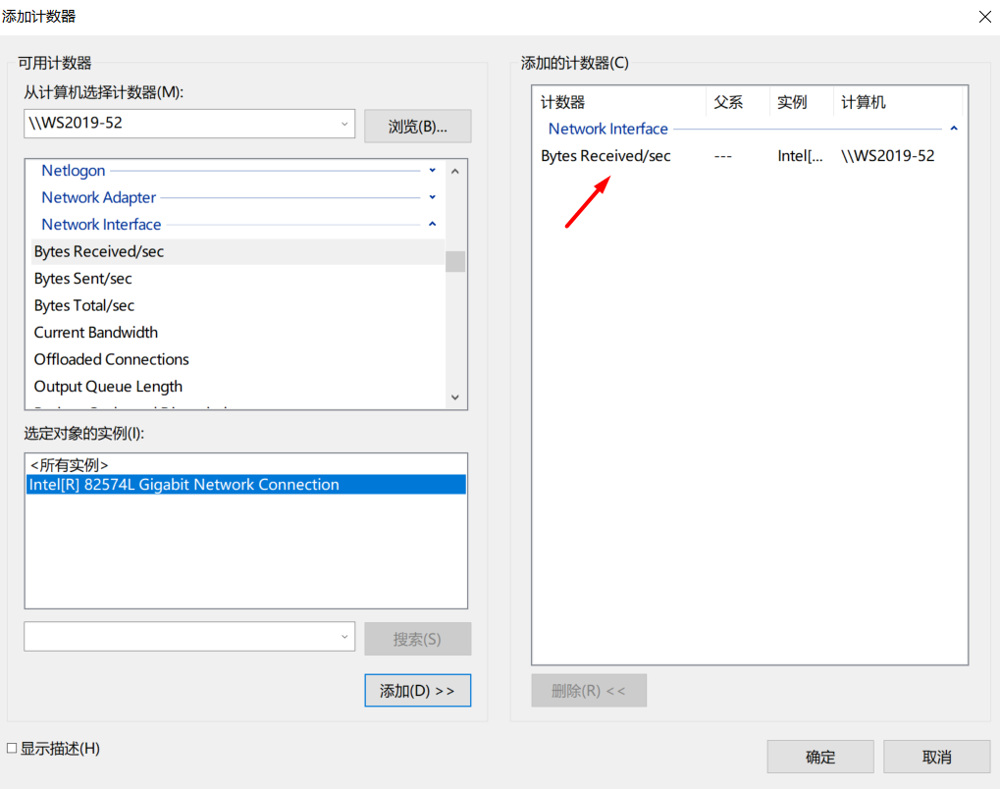
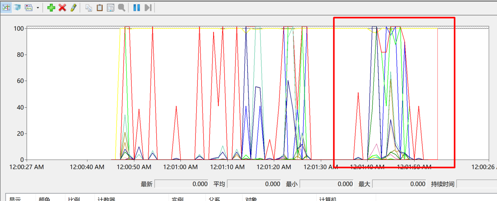
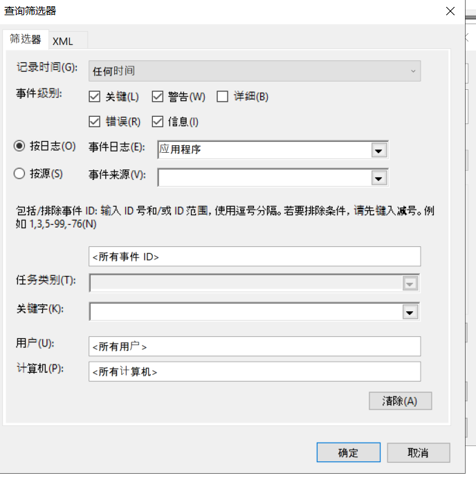

# 性能优化

# 1. 任务管理器检测系统瓶颈

应用: 当前登录用户打开的前台程序.

后台进程: 在后台运行的程序, 一般是服务.

如何发现某个前台程序占用CPU或者内存过多, 那么可以考虑在不影响服务正常运行的前提下, 杀死前台进程. 

杀死进程前, 可以查看程序文件的存放位置.

如果计算机中, 有病毒木马, 或者不知道占用大量资源的程序存放在了哪里, 可以使用此方法定位程序文件.

Windows系统可以通过任务管理器中的性能管理页面来查看系统运行的瓶颈, 然后根据不同的瓶颈进行操作. 内存小就加内存, CPU性能不行就增加CPU核数, 网络不行就加带宽, 上万兆等.

# 2. 资源监视器监控系统性能

# 3. 性能计数器监控系统性能

案例: 给计算机做一个磁盘整理, 查看磁盘利用率报告.

开启磁盘优化前的状态.

开启优化时.

案例: 系统诊断

通过系统自动诊断, 找到系统瓶颈.

查看报告.

# 4. 管理Windows日志, 日志订阅集中管理分析日志

筛选日志.

日志归档.

日志文件保存后, 可以直接双击打开.

指定日志文件大小.

指定大小后, 日志一旦满了, 可以进行如下操作.

订阅日志.

可以在一台服务器上, 订阅其他服务器的日志, 相当于把其他服务器的日志收集到本地, 便于分析.

收集WS2019-53的日志到本地.

查看订阅的日志.

订阅的日志会被存放到Forwarded Events中, 但是需要等一段时间才会收集完毕.

