# 本地安全策略加固服务

# 1. 配置密码策略

域环境中, 密码的策略是在域控制器上配置, 加入到域的其他服务器和计算机无法在本地配置密码策略.

将WS2019-52恢复到加域前的快照.

密码策略是在本地安全策略中进行配置.

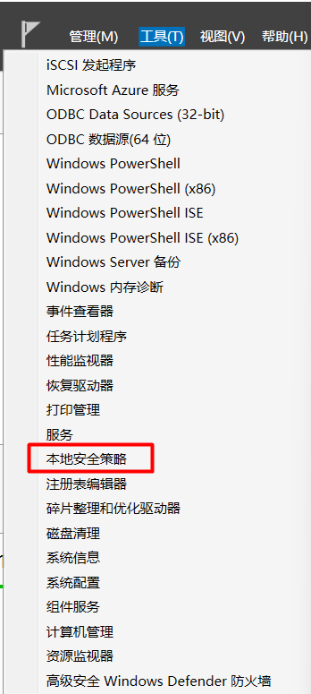


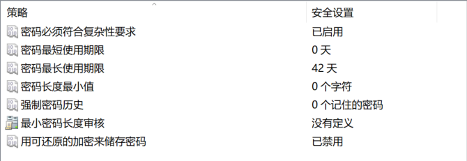

## 1.1 复杂度要求

建议开启.

开启后, 密码必须至少有6个字符.


案例: 密码复杂度设置.

开启:


创建用户:

此时, 因为密码复杂度不符合要求, 创建用户失败.


禁用密码复杂度要求:

禁用后. 即使密码为123, 也可以成功.


## 1.2 最短使用期限

数值为0: 修改一次密码后, 可立即再次修改.

数值为1-998: 修改一次密码后, 需要等1-998天才能再次修改密码.

密码最短使用期限必须小于密码最长使用期限, 除非将密码最长使用期间设置为0, 此时表示密码永不过期.

如果密码最长使用期限设置为0, 那么最短使用期限可以为0-998间的任何值.


案例: 最短使用期限.

0天表示可以立即修改:

注销后, 登录test1用户, 测试修改.

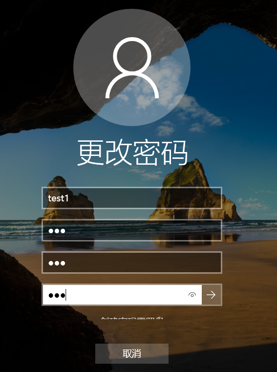


修改为1后, 需要等一天才能再次修改:


## 1.3 最长使用期限

密码最多可以使用几天. 根据公司环境设置.

如果为0, 表示密码永不过期.


案例: 最长使用期限为0.


## 1.4 密码长度最小值

密码至少需要多少个字符. 可以设为1-14之间.

设为0表示不需要密码.


## 1.5 强制密码历史

在使用某个之前使用过的重复密码前, 必须先已经使用几次其他的非重复的密码.


## 1.6 最小密码长度审核

用于触发当设置的密码过短时, 进行审核事件触发.

如果最小密码长度为10, 而该长度审核的值为8. 那么不会发出审核事件.

如果最小密码长度为10, 而该长度审核的值为11. 那么当新设置的密码长度小于该审核值时, 会发出审核事件.


## 1.7 用可还原的加密来存储密码


## 1.8 公司案例

```
开启密码复杂度要求

大写字母

小写字母

数字

特殊符号

最少10位

不能用最近的6个密码

密码3个月过期

最少使用1天
```

# 2. 账户锁定策略


## 2.1 允许管理员账户锁定

内置管理员一般不配置锁定. 管理员密码要设置的长, 而且难以猜测.


## 2.2 账户锁定阈值

几次错误后, 锁定账号. 0次表示账户不锁定.


## 2.3 账户锁定时间

账户锁定多久后, 自动解锁.


## 2.4 重置账户锁定计数器

重启账户锁定计数器的时间和账户锁定时间要一致. 防止黑客不断的利用计数器的重置来猜密码. 

账户锁定时间也不要太短. 建议锁定30分钟, 计数器重置也是30分钟. 这样即使有人恶意猜密码, 那么也要等30分钟计数器到时后, 才能再次猜密码. 否则账号就被锁了, 要等30分钟.

## 2.5 解锁本地账号


# 3. 启动审核策略跟踪安全事件

## 3.1 审核事件举例

审核策略用于告诉计算机记录哪些安全事件.


审核账户管理: 比如, 当有人在计算机上创建了账户时, 会进行记录.

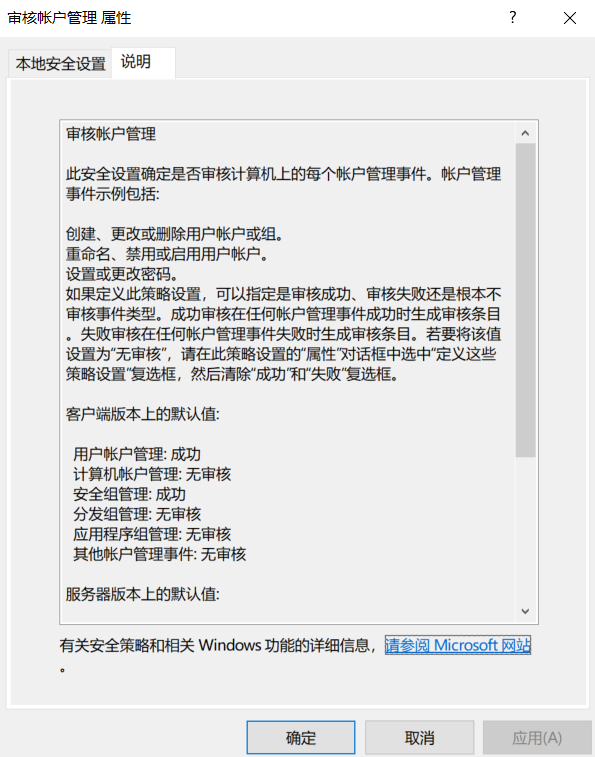


审核账户登录事件: 只要用户在登录时, 找到我这台服务器进行用户名和密码认证, 那么就记录下来. 一般是域控.


审核登录事件: 区别于审核用户登录事件, 这个审核登录事件一般审核的是登录到我这台本地计算机.


## 3.2 事件记录位置


登录失败事件:


记录创建用户事件:


创建一个用户会记录多个安全事件.


## 3.3 审核对象访问

可以用于记录用户对文件/文件夹的操作.

审核对象访问这里是针对所有用户. 也可以对某个单独的对象进行审核设置.


案例: 在服务器上创建一个homework目录, 禁止test1用户删除. 切换到test1用户, 尝试删除该目录.


只给test1读取权限.


在文件夹目录添加审核. 审核test1用户失败的读, 写, 修改等操作. (这里是仅针对该文件夹审核某个用户)


切换到test1用户, 尝试删除.


再回到管理员账号, 查看安全事件. 这里需要仔细查找安全事件记录.


# 4. 授予用户系统权限

这个权限针对的是用户对于操作系统的权限. 比如, 能否修改操作系统时间, 能否关闭系统的.


案例: 更改系统时间.


# 5. 配置安全选项

## 5.1 交互登录不显示上次登录用户名

启用后, 在计算机开机/注销重新登录时, 不会显示上次登录的用户名.


默认是禁用的, 所以计算机开机/注销重新登录时, 会显示上次登录的用户名.


开启后, 就不会显示这些用户名了.


## 5.2 计算机不活动限制

计算机多久没有操作后, 会锁定计算机. 需要再次输入账号密码登录.


案例: 设置10秒不使用, 就锁定屏幕.


## 5.3 提示用户在密码过期之间更改密码


## 5.4 无须按Ctrl+Alt+Del

默认是启用的, 用户在登录计算机时, 需要按Ctrl+Alt+Del来输入账号和密码.

关闭后, 则不需要. 只需按任意键, 就可以进入输入用户名和密码的界面.


## 5.5 试图登录的用户的消息文本和消息标题

在用户输入用户名和密码前, 给一个提示信息.


## 5.6 本地账户的共享和安全模型

一般针对计算机上的共享资源访问. 通常情况下, 当用户访问计算机上的共享资源时, 需要输入账号和密码. 而有时, 我们希望用户可以直接访问, 无需输入用户名和密码. 此时就可以用本地的Guest账号进行访问.

当用户访问该计算机的共享资源时, 会直接使用Guest账号进行访问. 无需输入账号密码.


仅来宾: 访问时使用本地的Guest账号.

Guest账号案例:

1. WS2019-52开启本地来宾访问.


2. 启用本地Guest账号, 不设置密码.


3. 禁用, 使用空密码的本地账号只允许进行控制台登录.


4. 在需要登录共享服务器的那台主机上(这里是WS2019-53), 修改本地组策略, 启用不安全的来宾登录.


5. 服务器本地创建共享.

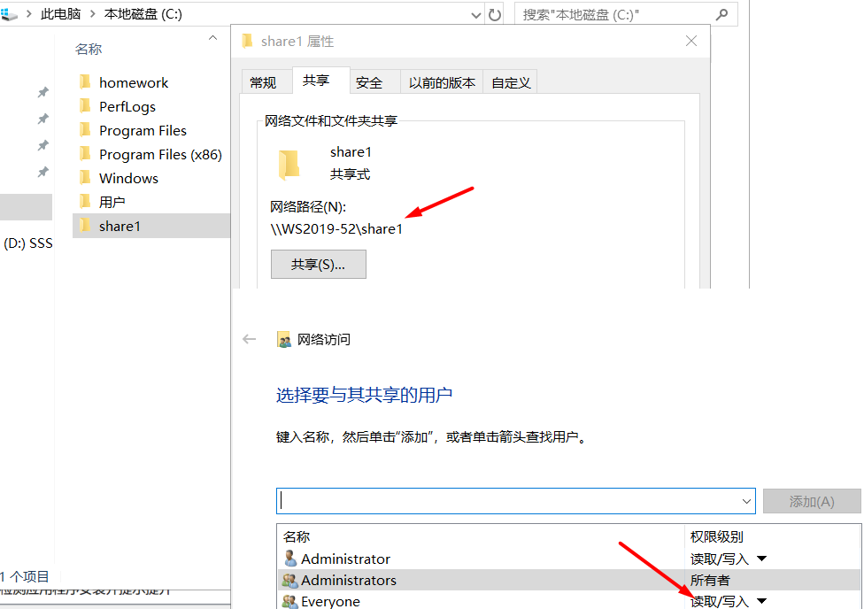

6. 其他计算机进行访问测试.

此时, 在其他的计算机上就可以直接访问该服务器的共享了. 并且创建的文件的所有者属于Guest. 如果还是访问不了, 那么要关闭文件共享服务器的防火墙.

这种利用Guest的方式, 适用于客户端没有键盘鼠标去输入用户名和密码的情况.

# 6. 软件限制策略-控制服务器允许运行的软件

通过策略, 限制哪些软件可以运行在本地计算机.

默认是没有限制的, 任何软件都可以在本地运行.


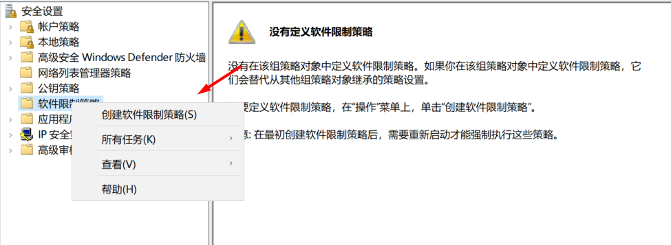

不允许: 无论用户的访问权如何, 软件都不会运行. 即使是本地管理员也无法运行. 

如果将策略设置为默认不允许, 那么很有可能造成连管理员都无法打开本地安全策略, 任何都无法运行任何软件.


基本用户: 允许程序访问一般用户可以访问的资源, 但没有管理员的访问权.


不受限: 软件访问权由用户的访问权来决定.


一般都设为默认不受限. 然后, 通过其他规则, 来指定不允许的软件.


## 6.1 哈希规则

哈希是具有固定长度的一系列字节，用于唯一标识某个软件程序或文件。 哈希由哈希算法计算。 为软件程序创建哈希规则后，软件限制策略将计算该程序的哈希。 当用户尝试打开某个软件程序时，会将该程序的哈希与软件限制策略的现有哈希规则进行比较。 不管软件程序位于计算机上的哪个位置，该程序的哈希都始终相同。 但是，如果以任何方式对软件程序做了更改，则其哈希也会更改，不再与软件限制策略的哈希规则中的哈希匹配。

例如，可以创建一个哈希规则并将安全级别设置为“不允许”，以防止用户运行特定的文件。 可以重命名某个文件或将其移到另一个文件夹，而哈希仍保持相同。 但是，如果对该文件进行了任何更改，则也会更改它的哈希值，并允许它绕过限制。


案例: 禁止所有用户使用计算器.


重启服务器生效.


## 6.2 路径规则

禁止某个目录下的程序被运行.

把路径添加到其他规则即可. 尤其是对于一个共享文件夹, 为了避免有人把一个病毒文件放了进去, 又运行了病毒文件.

## 6.3 证书规则

软件开发完, 通过数字证书进行签名, 防止被人恶意修改再发布.

以Git安装程序为例.


可以先把证书创建出来, 然后在证书规则中指定, 只有被该证书签名了的.exe程序才能运行, 或者都不能运行.

# 7. APPLocker

APPLocker可以进行更细致的控制. 允许哪些用户运行哪些软件, 不允许哪些用户运行哪些软件.


案例: 拒绝test1用户, 打开notepad.exe.

1. 创建test2用户.


2. 创建规则, 不允许test1打开notepad.exe.


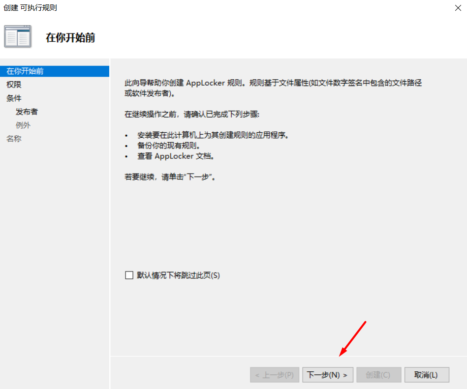


3. 创建了拒绝的规则后, 系统会创建默认的运行规则, 运行其他人打开该程序.


4. 配置强制规则, 否则不会生效.


5. 确保Application Identity服务运行.


6. 切换到test1和test2测试.

test1


test2

此时, 会发现, test2登录后, 无法点击Windows开始按钮, 也无法打开Search功能, 没反应. 这是系统bug, 我们可以在FileExplorer中找到notepad.exe尝试打开.


# 8. 使用组策略控制用户和计算机的行为


案例: 禁止打开cmd和注册表编辑器.


测试.

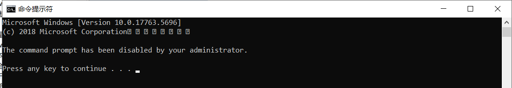


即使是本地管理员账号也无法打开. 但是本地管理员可以进行权限的修改.

# 9. 使用登录脚本给手机发短信, 监控用户登录


把脚本添加到开机启动登录脚本中. 一旦有人登录, 那么该脚本会自动运行. 提示有人登录.

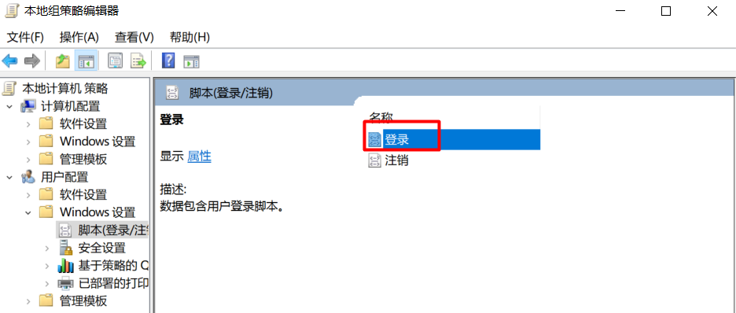


# 10. 在域中使用组策略统一配置服务器安全

新建一个服务器组织单位, 把两个服务器移动到服务器组织单位. 独立管理该组织单位.


创建了一个组织单位, 就可以在域的组策略中, 独立进行管理.


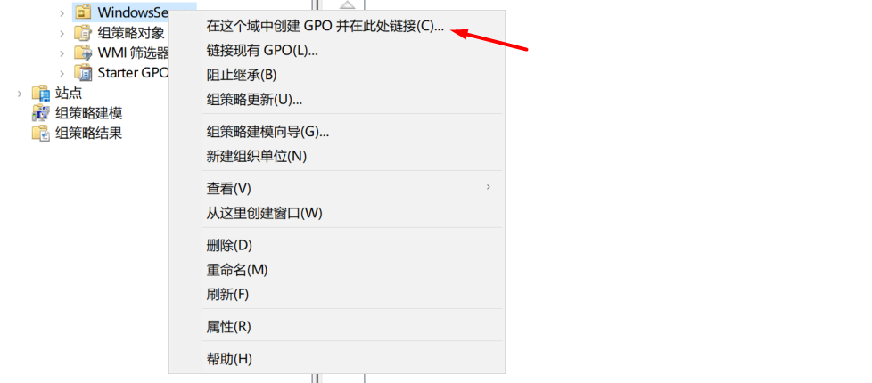


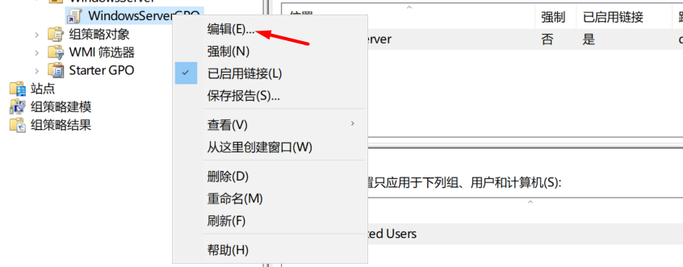

启用密码复杂度要求. 


三次错误, 锁定账号. 


给该组织单位中的服务器, 分配管理员. 让域用户成为这个组织单位内的服务器的管理员.

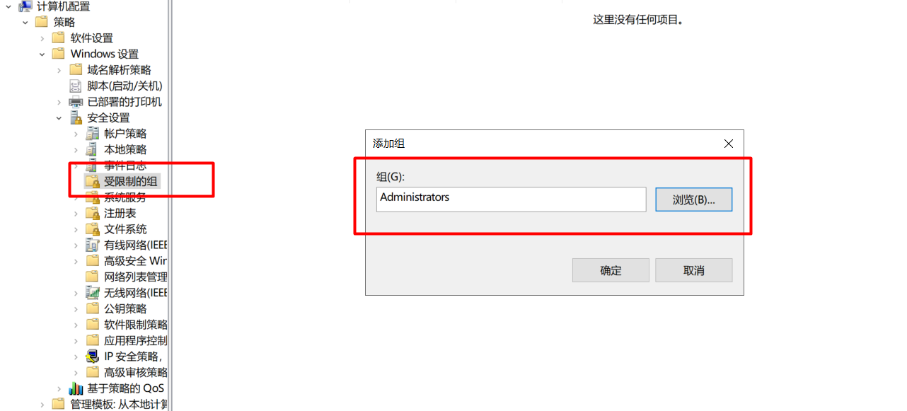


编辑了组策略后, 需要在被管理的主机进行更新. 一般一个小时后会自动刷新. 


验证密码复杂度.

登录到WS2019-52. 刷新组策略前. 可以看到账户锁定阈值没变.


密码长度最小值也没变.


刷新组策略.


再次查看.


local1登录时, 修改密码. 验证密码必须大于10位.


验证local1可以在WS2019-52上创建新账号.


并且自动把local1和local2两个用户添加到了Administrators组.


而其他的域用户是没有权限在服务器本地创建账号的.


**加入到域中的计算机, 无论是服务器还是客户端, 都会优先使用域的组策略. 如果设置了域的组策略, 那么是无法在本地进行修改的. 如果域中的组策略没有配置, 那么可以在本地修改.**


